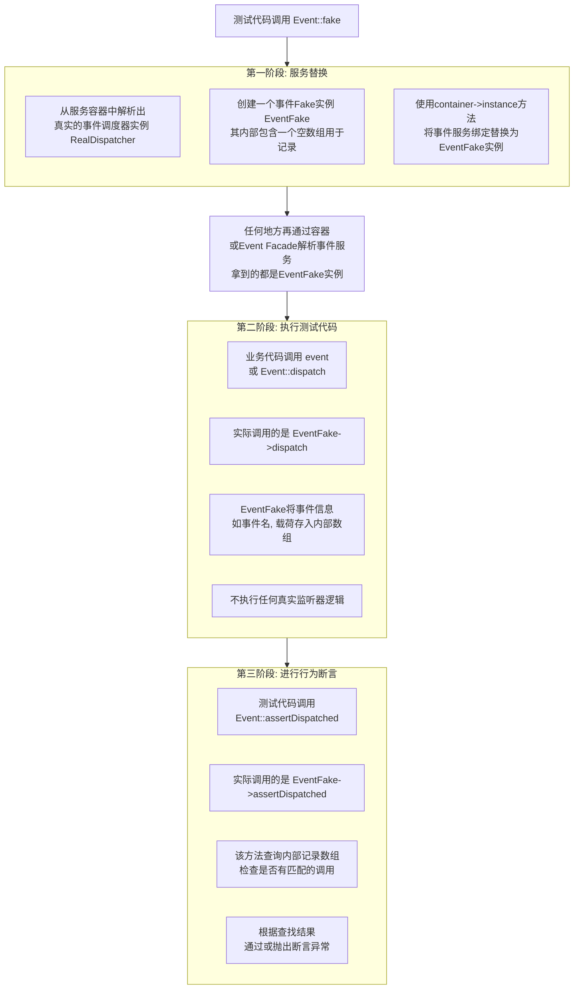

* content
{:toc}

## 引言

Laravel 中的 Facades（门面）是一个核心概念，它提供了一种简洁、富有表现力的语法来访问 Laravel 服务容器中注册的服务。尽管它们看起来像是静态方法调用，但实际上它们是一种强大而灵活的“静态代理”，背后连接着容器中解析出的实际对象实例。

## 一、背景：为什么需要 Facades？

在深入原理之前，理解其设计动机很重要：

1.  简洁性与表达性：
    *   想象一下，每次需要使用日志功能时，都要写 `$logger = app('log'); $logger->info('message');` 或通过构造函数注入 `LoggerInterface $logger`。虽然依赖注入是好的实践，但对于框架提供的、非常常用的服务（如日志、缓存、数据库、请求、配置等），这种写法显得冗长。
    *   Facades 允许你用 `Log::info('message')` 这样简洁、接近自然语言的静态语法来调用功能，极大地提高了代码的可读性和书写速度。

2.  解耦与服务定位：
    *   Facades 充当了你代码和底层服务实现之间的一个抽象层。你的控制器、模型或其他类不需要关心如何获取日志记录器或缓存存储器的具体实例。
    *   它们本质上是一种**服务定位器模式**的优雅实现，帮你从服务容器（IoC Container）中解析出需要的服务实例。

3.  可测试性：
    *   虽然 Facades 看起来是静态的，但 Laravel 提供了强大的测试工具（如 `Facade::shouldReceive()`）让你在测试中轻松模拟（Mock）或监听（Spy） Facades 背后的实际服务。这使得测试依赖于这些服务的代码变得可行。

4.  IDE 友好（有辅助）：
    *   配合 [Laravel IDE Helper](https://github.com/barryvdh/laravel-ide-helper) 这样的工具（它会生成包含 `@method` 静态方法注解的 Facade 类文档），现代 IDE 可以为 Facades 提供准确的自动完成和代码提示，解决了传统静态类带来的 IDE 支持不足的问题。

## 二、原理：静态外表下的动态本质

Facades 的魔力在于它们巧妙地利用了 PHP 的特性（特别是魔术方法 `__callStatic`）和 Laravel 的服务容器：

1.  核心组件：
    *   Facade 基类 (`Illuminate\Support\Facades\Facade`): 所有自定义 Facade 都必须继承这个基类。它定义了核心的魔术方法 `__callStatic`。
    *   服务容器 (IoC Container): Laravel 的核心，负责绑定服务接口到具体实现，并管理这些服务的创建和生命周期。
    *   Facade 别名系统： `config/app.php` 中的 `aliases` 数组将简短的名字（如 `'Log'`）映射到完整的 Facade 类（如 `Illuminate\Support\Facades\Log`）。Composer 的自动加载机制利用这个别名系统在需要时加载正确的 Facade 类。

2.  工作流程（以 `Log::info('Test')` 为例）：
    1.  调用静态方法： 你在代码中写下 `Log::info('Test')`。
    2.  查找 Facade 类： PHP 根据当前命名空间或通过 `config/app.php` 中定义的别名 `'Log' => Illuminate\Support\Facades\Log::class` 找到 `Illuminate\Support\Facades\Log` 这个类。
    3.  `__callStatic` 魔术方法： `Log` 类本身没有定义静态 `info` 方法。PHP 会调用其父类 `Facade` 的 `__callStatic($method, $args)` 方法。
    4.  获取服务实例： `__callStatic` 方法内部调用 `static::getFacadeRoot()`。
        *   `getFacadeRoot()` 方法检查 Facade 是否已经缓存了一个实例（单例优化）。如果没有，它调用 `static::resolveFacadeInstance(static::getFacadeAccessor())`。
        *   `static::getFacadeAccessor()` 是一个**关键方法**，它由具体的 Facade 类（这里是 `Illuminate\Support\Facades\Log`）实现。这个方法**返回一个字符串标识符**（通常是服务在容器中绑定的名字，如 `'log'` 或接口名 `Psr\Log\LoggerInterface`）。
        *   `resolveFacadeInstance` 方法拿着这个标识符 `'log'`，**去服务容器（`app()`）中请求解析（resolve）出对应的实际对象实例**（例如，一个 `Illuminate\Log\Logger` 实例）。服务容器知道如何创建或找到绑定到这个标识符的具体对象。
    5.  调用实际方法： `__callStatic` 方法拿到这个从容器中解析出来的真实 Logger 对象（假设叫 `$instance`）后，执行 `$instance->$method(...$args)`，也就是 `$instance->info('Test')`。
    6.  结果返回： 真实对象方法的返回值最终通过 `__callStatic` 返回到你的 `Log::info('Test')` 调用处。

总结原理： Facade 是一个**静态代理**。它本身没有业务逻辑，只是通过 `__callStatic` 魔术方法，将静态调用**转发（代理）** 给服务容器中解析出来的**真实服务对象实例**。`getFacadeAccessor()` 方法告诉 Facade 基类在容器中找哪个服务。

## 三、如何使用 Laravel Facades

使用内建 Facades 非常简单：

1.  引入（通常不需要显式引入）：
    *   得益于 `config/app.php` 中的 `aliases` 配置和 Composer 自动加载，大多数常用 Facades（如 `Cache`, `Route`, `DB`, `Log`, `Auth`, `Config`, `Request`, `Response`, `Session`, `View` 等）可以直接在类中使用它们的短名，无需 `use` 语句（只要你在 `app.php` 的 `aliases` 里配置了它们，默认都配置好了）。
    *   如果使用未配置别名或自定义的 Facade，需要在类顶部使用 `use` 引入完整的 Facade 类名。

2.  直接调用静态方法：
    *   语法：`FacadeName::methodName(arguments);`
    *   示例：

```php
// 记录日志 (使用 Log Facade)
use Illuminate\Support\Facades\Log; // 通常可省略，因别名存在
Log::info('User logged in.', ['user_id' => Auth::id()]); // Auth 也是 Facade
Log::error('Something went wrong!');

// 缓存操作 (使用 Cache Facade)
$value = Cache::get('key');
Cache::put('key', $value, $minutes = 60);
if (Cache::has('key')) { ... }

// 数据库查询 (使用 DB Facade)
$users = DB::table('users')->where('active', 1)->get();

// 获取配置 (使用 Config Facade)
$timezone = Config::get('app.timezone');
Config::set('app.locale', 'en');

// 重定向 (使用 Redirect Facade)
return Redirect::to('home');
return Redirect::back()->withInput();

// 发送响应 (使用 Response Facade)
return Response::json(['status' => 'success']);
```

## 四、创建自定义 Facades

如果你有自己的服务注册到容器中，并希望为其提供 Facade 访问方式：

1、在服务容器中注册服务：通常在服务提供者（`App\Providers\AppServiceProvider` 或自定义的 Provider）的 `register` 方法中绑定。
    
```php
// AppServiceProvider.php
public function register()
{
    $this->app->singleton('myService', function ($app) {
        return new \App\Services\MyService(config('some.setting')); // 返回你的服务实例
    });
}
```

2、创建 Facade 类：在 `app/Facades` 目录下（Laravel 无强制要求，但这是惯例）创建文件 `MyServiceFacade.php`。

```php
// app/Facades/MyServiceFacade.php
namespace App\Facades;

use Illuminate\Support\Facades\Facade;

class MyServiceFacade extends Facade
{
    /**
     * 获取组件的注册名称。
     *
     * @return string
     */
    protected static function getFacadeAccessor()
    {
        return 'myService'; // 必须与容器中绑定的标识符一致
    }
}
```

3、（可选）添加别名：在 `config/app.php` 的 `aliases` 数组中添加：

```php
'aliases' => [
    // ... 其他别名
    'MyService' => App\Facades\MyServiceFacade::class,
],
```

4、使用自定义 Facade：现在可以像使用内置 Facade 一样使用你的服务了：

```php
// 使用别名（如果配置了）
MyService::doSomething();
// 或者使用完整的类名（需要 use）
use App\Facades\MyServiceFacade;
MyServiceFacade::doSomething();
```

## 五、重要注意事项与最佳实践

1、理解它不是真正的静态类： 牢记 Facade 是代理。背后的对象是动态从容器解析的，通常遵循容器的绑定规则（如单例、绑定接口到实现等）。

2、依赖注入 vs Facades：

*   依赖注入（构造函数注入或方法注入） 是更显式、更符合 SOLID 原则（特别是依赖反转）的方式，它清晰地展示了类的依赖关系，是 Laravel 官方推荐的主要方式，尤其对于你自己编写的核心业务逻辑类。
*   Facades 提供极致的便利性，特别适合在**模板（Blade）、路由闭包、测试代码**中，以及访问那些**框架内置的、无处不在的服务**时使用。在控制器中适度使用也是常见的。
*   最佳实践： 对于自定义的、业务核心的服务，**优先考虑依赖注入**。对于 Laravel 框架提供的常用服务（Log, Cache, Config, Auth 等），**可以放心且合理地使用 Facades** 来简化代码。避免在模型内部过度使用 Facades。

3、测试：Laravel 内置了优秀的 Facade 测试支持。使用 `Facade::spy()` 或 `Facade::shouldReceive()` 来模拟或监听 Facade 调用：

```php
// 在测试中 (e.g., PestPHP or PHPUnit)
use Illuminate\Support\Facades\Cache;
test('it caches data', function () {
    Cache::shouldReceive('get') // 模拟 Cache::get 调用
            ->once()
            ->with('key')
            ->andReturn('cached-value');
    // 调用你的被测代码，它会使用 Cache::get('key')
    $result = // ... your code under test
    // 断言...
});
```

4、IDE 辅助：
    *   强烈推荐安装 [Laravel IDE Helper](https://github.com/barryvdh/laravel-ide-helper) 扩展包。运行 `php artisan ide-helper:generate` 命令会为所有 Facades 生成包含 `@method` 注解的文档块，让你的 IDE（如 PhpStorm, VSCode）能够完美地提供自动完成、参数提示和跳转到定义的功能，消除使用 Facades 在 IDE 支持上的痛点。

## 动态类别名注册

在 Laravel 中，通过 `config/app.php` 中的 `aliases` 数组配置后就能直接使用 `Log::info('test')` 这样的语法，背后是一个精妙的类别名自动加载机制。以下是详细原理：

### 核心原理

Laravel 使用 `AliasLoader` 在运行时动态创建类别名，主要流程如下：

1、引导阶段注册加载器
   - 在框架启动阶段（`bootstrap/app.php`）
   - 执行 `Illuminate\Foundation\Bootstrap\RegisterFacades::bootstrap()`
   - 关键代码：

```php
AliasLoader::getInstance($aliases)->register();
```

这里 `$aliases` 就是 `config/app.php` 中的别名配置数组。

---

项目入口 `index.php` 中 `$kernel = $app->make(Illuminate\Contracts\Http\Kernel::class)` 获取http服务，调用 `$kernel->handle($request = Illuminate\Http\Request::capture())` 方法处理请求。

在 `Illuminate\Foundation\Http` 目录下的 `Kernel.php` 中

```php
protected $bootstrappers = [
    \Illuminate\Foundation\Bootstrap\LoadEnvironmentVariables::class,
    \Illuminate\Foundation\Bootstrap\LoadConfiguration::class,
    \Illuminate\Foundation\Bootstrap\HandleExceptions::class,
    \Illuminate\Foundation\Bootstrap\RegisterFacades::class,  // Facade 门面服务
    \Illuminate\Foundation\Bootstrap\RegisterProviders::class,
    \Illuminate\Foundation\Bootstrap\BootProviders::class,
];

// 服务处理
public function handle($request)
{
    try {
        $request->enableHttpMethodParameterOverride();

        $response = $this->sendRequestThroughRouter($request);  // 发送请求到路由
    } catch (Exception $e) {
        $this->reportException($e);

        $response = $this->renderException($request, $e);
    } catch (Throwable $e) {
        $this->reportException($e = new FatalThrowableError($e));

        $response = $this->renderException($request, $e);
    }

    $this->app['events']->dispatch(
        new RequestHandled($request, $response)
    );

    return $response;
}

protected function sendRequestThroughRouter($request)
{
    $this->app->instance('request', $request);

    Facade::clearResolvedInstance('request');

    $this->bootstrap();  // 引导应用

    return (new Pipeline($this->app))
        ->send($request)
        ->through($this->app->shouldSkipMiddleware() ? [] : $this->middleware)
        ->then($this->dispatchToRouter());
}

public function bootstrap()
{
    if (! $this->app->hasBeenBootstrapped()) {
        $this->app->bootstrapWith($this->bootstrappers());  // 引导应用
    }
}

protected function bootstrappers()
{
    return $this->bootstrappers;
}
```

app 服务容器中：

```php
public function bootstrapWith(array $bootstrappers)
{
    $this->hasBeenBootstrapped = true;

    foreach ($bootstrappers as $bootstrapper) {
        $this['events']->dispatch('bootstrapping: '.$bootstrapper, [$this]);

        // 获取 \Illuminate\Foundation\Bootstrap\RegisterFacades::class 服务，服务再进行bootstrap($app)引导
        $this->make($bootstrapper)->bootstrap($this);  

        $this['events']->dispatch('bootstrapped: '.$bootstrapper, [$this]);
    }
}
```

`Illuminate\Foundation\Bootstrap\RegisterFacades` 中的 bootstrap 方法
```php
<?php

namespace Illuminate\Foundation\Bootstrap;

use Illuminate\Contracts\Foundation\Application;
use Illuminate\Foundation\AliasLoader;
use Illuminate\Foundation\PackageManifest;
use Illuminate\Support\Facades\Facade;

class RegisterFacades
{
    public function bootstrap(Application $app)
    {
        Facade::clearResolvedInstances();

        Facade::setFacadeApplication($app);

        AliasLoader::getInstance(array_merge(
            $app->make('config')->get('app.aliases', []),
            $app->make(PackageManifest::class)->aliases()
        ))->register();
    }
}
```

2、AliasLoader 的工作机制

```php
class AliasLoader 
{
    private function __construct($aliases)
    {
        $this->aliases = $aliases;
    }

    // 初始化所有配置别名
    public static function getInstance(array $aliases = [])
    {
        if (is_null(static::$instance)) {
            return static::$instance = new static($aliases);
        }

        $aliases = array_merge(static::$instance->getAliases(), $aliases);

        static::$instance->setAliases($aliases);

        return static::$instance;
    }

    // 使用 `spl_autoload_register` 注册自定义加载器
    public function register() 
    {
        spl_autoload_register([$this, 'load'], true, true);
    }
    
    // 当遇到未定义的类（如 `Log`）时触发加载器
    public function load($alias) 
    {
        if (isset($this->aliases[$alias])) {
            return class_alias($this->aliases[$alias], $alias);
        }
    }

    // ...
}
```

   - 使用 `spl_autoload_register` 注册自定义加载器
   - 当遇到未定义的类（如 `Log`）时触发加载器

3、动态创建类别名
   - 当检测到 `Log` 类不存在时
   - 加载器查找别名配置，发现：

```php
'Log' => Illuminate\Support\Facades\Log::class
```

   - 执行核心函数：

```php
class_alias(Illuminate\Support\Facades\Log::class, 'Log');
```

   - 这相当于在运行时创建了：

```php
class Log extends Illuminate\Support\Facades\Log {}
```

### 执行流程示例

`Log::info('test')`

1、首次调用触发自动加载

```php
Log::info('test');
// ↓ PHP 发现 Log 类未定义
// ↓ 触发已注册的 autoloader
```

2、AliasLoader 处理

```php
// 在 AliasLoader::load() 中
class_alias('Illuminate\Support\Facades\Log', 'Log');
```

3、Facade 魔术方法生效

```php
<?php

namespace Illuminate\Support\Facades;

// 现在 Log 指向 Illuminate\Support\Facades\Log
class Log extends Facade 
{
    protected static function getFacadeAccessor() 
    {
        return 'log'; // 返回服务容器绑定名
    }
}
```

调用 `Log::info('test')`，Log 类找到了， 但`info()`方法不存在，调用父类 Facade 中 `__callStatic` 方法：

```php
// 调用静态方法时触发Facade基类的 __callStatic
public static function __callStatic($method, $args) 
{
    $instance = static::getFacadeRoot(); // 从容器解析 log 服务 
    return $instance->$method(...$args); // 执行真正的 info 方法
}
```

### 关键技术点

1. class_alias() 函数
   - PHP 内置函数，运行时创建类别名
   - 不创建新类，只是给现有类增加别名
   - 内存高效，无额外开销

2. spl_autoload_register
   - 优先于 Composer 的自动加载器注册（第三个参数 `true` 表示前置）
   - 确保在查找物理文件前处理别名

3. 服务容器绑定

```
[Log Facade] --> |getFacadeAccessor|  -->  (log)  -->  |服务容器|  -->  [实际日志实例]
```

### 为什么不需要手动引入？

- 别名加载器在类使用前完成注册
- 实际类（`Illuminate\Support\Facades\Log`）通过 Composer 自动加载
- 整个过程完全透明：
  1. 使用未定义的类 `Log`
  2. 触发别名加载器
  3. 创建别名指向真实类
  4. 真实类通过 Composer 加载
  5. 执行 Facade 代理逻辑

### 性能考虑

- 别名注册仅在**首次使用**时发生
- 后续调用直接使用已存在的别名类
- 生产环境开启 opcache 后零性能损耗
- 比真正的静态类更优（支持依赖注入和模拟）

这种设计完美平衡了开发便利性和框架灵活性，是 Laravel 优雅架构的典范之作。

## 从容器解析 log 服务

上面在 `Log::info('test')` 时讲到了：

```php
public static function __callStatic($method, $args) 
{
    $instance = static::getFacadeRoot(); // 从容器解析 log 服务
    return $instance->$method(...$args); // 执行真正的 info 方法
}
```

我们来深入、完整地追溯分析 `$instance = static::getFacadeRoot();` 这行代码是如何从 Laravel 的服务容器（IoC Container）中解析出 `log` 服务的真实实例的。

这是一个层层递进的过程，我们将从 Facade 的静态调用开始，一直追踪到服务容器返回一个具体的 `Illuminate\Log\LogManager` 实例。

### 调用栈概览

整个解析过程遵循一个清晰的调用链，其核心流程如下：

[Facade静态调用 `Log::info('test')`] --> [触发Facade基类 `__callStatic`] --> [调用 getFacadeRoot 获取实例根对象] --> [调用 resolveFacadeInstance 解析]  --> [调用 getFacadeAccessor 获取服务名] --> [返回服务标识符 `'log'`] --> [向App容器请求解析 `app['log']`] --> [容器根据绑定返回 Logger 实例] --> [缓存并返回该 实例] --> [最终调用实例方法: `info('test')`]

下面是每个步骤的详细分解。

---

### 步骤 1: 静态调用的入口 

- `__callStatic`

当您调用 `Log::info('test')` 时，由于 `Log` Facade 自身没有定义静态方法 `info`，PHP 会调用其父类 `Illuminate\Support\Facades\Facade` 的魔术方法 `__callStatic`。

文件： `vendor/laravel/framework/src/Illuminate/Support/Facades/Facade.php`

```php
/**
 * Handle dynamic, static calls to the object.
 *
 * @param  string  $method
 * @param  array  $args
 * @return mixed
 *
 * @throws \RuntimeException
 */
public static function __callStatic($method, $args)
{
    // 第一步：获取它代理的真正对象实例
    $instance = static::getFacadeRoot();

    // 如果获取到的实例为 null，则抛出异常
    if (! $instance) {
        throw new RuntimeException('A facade root has not been set.');
    }

    // 第二步：调用真实实例上的方法
    return $instance->$method(...$args);
}
```

这是整个流程的起点。 它的首要任务就是获取它所要代理的那个真实对象实例。

---

### 步骤 2: 获取根实例 

- `getFacadeRoot()`

`getFacadeRoot()` 方法是 Facade 获取真实实例的核心。

文件： `vendor/laravel/framework/src/Illuminate/Support/Facades/Facade.php`

```php
/**
 * Get the root object behind the facade.
 *
 * @return mixed
 */
public static function getFacadeRoot()
{
    // 关键点：这里调用的是 static::resolveFacadeInstance(...)
    // 这意味着它会使用最终子类（如 Log Facade）实现的 getFacadeAccessor 方法
    return static::resolveFacadeInstance(static::getFacadeAccessor());
}
```

这个方法做了两件事：
1.  调用 `static::getFacadeAccessor()` 获取在服务容器中注册的**绑定名称**。
2.  将这个绑定名称传递给 `static::resolveFacadeInstance()` 方法去解析。

---

### 步骤 3: 识别服务标识

- `getFacadeAccessor()`

这个方法由具体的 Facade 类实现，它告诉框架：“我代表的是容器里绑定的哪个东西？”

文件： `vendor/laravel/framework/src/Illuminate/Support/Facades/Log.php`

```php
namespace Illuminate\Support\Facades;

/**
 * @see \Illuminate\Log\Logger
 */
class Log extends Facade
{
    /**
     * Get the registered name of the component.
     *
     * @return string
     */
    protected static function getFacadeAccessor()
    {
        return 'log'; // 就是返回这个字符串标识
    }
}
```

到这里，我们拿到了关键信息：字符串 `'log'`。 这个 `'log'` 就是在服务容器中注册日志服务时使用的键名。

---

### 步骤 4: 解析实例 

- `resolveFacadeInstance()`

现在我们有了服务名称 `'log'`，下一步就是拿着这个名字去容器里找对应的实例。

文件： `vendor/laravel/framework/src/Illuminate/Support/Facades/Facade.php`

```php
/**
 * Resolve the facade root instance from the container.
 *
 * @param  object|string  $name
 * @return mixed
 */
protected static function resolveFacadeInstance($name)
{
    // 如果是对象，直接返回（但通常 'log' 是字符串）
    if (is_object($name)) {
        return $name;
    }

    // 检查是否已经解析过并缓存过这个实例
    if (isset(static::$resolvedInstance[$name])) {
        return static::$resolvedInstance[$name];
    }

    // 最核心的一行：通过服务容器解析实例
    // app() 是全局辅助函数，返回服务容器的实例
    // ->make($name) 是容器的方法，意为“解析绑定名为 $name 的服务”
    return static::$resolvedInstance[$name] = app()->make($name);
}
```

这个方法的核心是 `app()->make('log')`。
- `app()`: 辅助函数，返回 Laravel 应用程序实例（即服务容器本身）。
- `make($abstract)`: 容器的方法，用于解析给定的抽象类型（绑定名）。

到这里，Facade 的工作就基本完成了，它把任务抛给了服务容器。 接下来是容器内部的解析过程。

---

### 步骤 5: 服务容器接管 

- `app()->make('log')`

服务容器接收到解析 `'log'` 的指令。它会查找自己的绑定记录，看看 `'log'` 对应的是什么。

这个绑定是在框架启动时，由 日志服务提供者 (LogServiceProvider) 完成的。

文件： `vendor/laravel/framework/src/Illuminate/Log/LogServiceProvider.php`

```php
namespace Illuminate\Log;

class LogServiceProvider extends ServiceProvider
{
    /**
     * Register the service provider.
     *
     * @return void
     */
    public function register()
    {
        // 在容器中以单例形式注册 'log'
        // 当解析 'log' 时，就执行这个闭包函数来创建实例
        $this->app->singleton('log', function () {
            return new LogManager($this->app);  // 传入日志管理器
        });
    }
}
```

在 app 项目服务容器`__construct`实例化时，`$this->registerBaseServiceProviders()` 中 `$this->register(new LogServiceProvider($this));` 注册日志服务。

所以，当容器执行 `app()->make('log')` 时：
1.  它知道 `'log'` 被绑定为一个**单例（singleton）**（意味着多次解析返回同一个实例）。
2.  它执行注册时定义的闭包函数。
3.  这个闭包函数 创建并返回了一个 `Illuminate\Log\LogManager` 的实例。

这个 `LogManager` 实例就是 `Log` Facade 背后真正的对象。

---

### 步骤 6: 完成调用 

- `$instance->info('test')`

现在，`__callStatic` 方法中的 `$instance` 变量已经是一个具体的 `LogManager` 对象了。最后一步就是调用这个对象上的 `info` 方法。

```php
// $instance 现在是一个 Illuminate\Log\LogManager 对象
// 调用它的 info 方法，并传入参数 'test'
return $instance->info('test');
```

`LogManager` 类会处理日志的写入、格式化以及事件触发等所有实际逻辑。

---

### 核心要点

1.  代理模式： Facade 是一个**静态代理**，它自己不干活，只是负责找到干活的“工人”（真实实例）。
2.  服务容器是核心： Facade 的强大完全依赖于 Laravel 的服务容器。容器负责管理和依赖注入这些真实实例。
3.  关键桥梁： `getFacadeAccessor()` 方法是 Facade 和容器之间的桥梁，它返回服务在容器中的**注册键**。
4.  缓存优化： `$resolvedInstance` 数组缓存了已解析的实例，避免了每次调用都去容器里重新解析的开销，提升了性能。
5.  可测试性： 正因为 Facade 底层是通过 `app->make()` 解析的，我们可以在测试中很容易地用 `Log::shouldReceive('info')` 来模拟（Mock）这些调用，而无需关心底层的容器绑定。

通过这个完整的追溯，您可以看到 Laravel 的 Facade 并非“魔法”，而是一套设计精巧、基于服务容器的静态接口实现，完美地平衡了代码的简洁性和灵活性。

## 总结

Laravel Facades 是一个强大的设计，它通过静态代理模式和服务容器，为开发者提供了访问框架服务的极其简洁、优雅的语法。理解其背后的原理（`spl_autoload_register` + `__callStatic` + 服务容器 + `getFacadeAccessor`）是关键。它们不是邪恶的“静态陷阱”，而是 Laravel 为提升开发体验而精心设计的工具。在实际开发中，明智地结合使用依赖注入（首选）和 Facades（用于便利性场景），并配合 IDE Helper 工具，可以让你高效、愉快地构建 Laravel 应用。

## 配合测试

我们来详细、深入地探讨 Laravel 6 中与 Facade 测试相关的内容。这是 Laravel 测试体系中非常强大和独特的一部分，理解它能极大地提升你的测试效率和代码质量。

### 核心思想

核心思想：为什么 Facade 可以被测试？

首先，必须再次强调：Facades 不是静态方法！ 它们是动态对象的静态接口代理。正是因为这个设计，Laravel 才能让你在测试中“偷梁换柱”——将 Facade 背后代理的真实实例替换成一个模拟对象（Mock）或监听器（Spy），从而进行隔离测试。

### 测试方法概览

Laravel 主要提供了两种方式来测试与 Facade 的交互：

1.  使用 Mockery（更底层、更灵活）： 直接使用 [Mockery](https://github.com/mockery/mockery) 库来创建模拟对象，并告诉 Facade 使用这个模拟对象。
2.  使用内置的 Fake（更简洁、更直观）： Laravel 为许多常用的 Facade（如 `Cache`, `Queue`, `Notification`, `Event` 等）提供了开箱即用的“Fakes”，它们是为测试量身定制的模拟实现。

---

### 方法一：Mockery模拟

方法一：使用 Mockery 进行模拟

这是最通用和强大的方法，适用于所有 Facade。

#### 原理

你使用 `Mockery::mock` 创建一个模拟对象，然后使用 Facade 的 `shouldReceive` 方法将这个模拟对象“注入”到 Facade 的静态代理背后。之后，你可以在模拟对象上定义期望。

#### 语法与示例

假设我们有一个服务 `App\Services\PaymentProcessor`，它使用了 `Http` Facade（假设存在）来发起外部请求。我们想测试 `process` 方法是否正确地发起了 POST 请求。

1、定义期望（Expectations）

首先，我们要明确两种主要的测试验证方式：

* 状态验证 (State Verification)：检查被测代码执行后，系统状态是否如预期所变。例如，数据库中的某条记录是否被更新，一个对象的属性值是什么，或者一个方法的返回值是什么。
    * 断言目标：`$result`, `$user->name`, `DB::table(...)->get()`

* 行为验证 (Behavior Verification)：检查被测代码是否以正确的方式与它的依赖项进行了交互。它不关心最终状态，只关心“是否发生了某个行为”。核心原理：期望（Expectations）与验证（Verification）。传统的状态断言是 “事后检查”：代码运行完毕后，我去检查结果（状态）是否正确。行为断言是 “事前约定，事后验证”：在代码运行之前，我先定义好我期望发生的行为（“这个函数应该被调用1次，并且参数是A和B”）。代码运行之后，由 Mocking 框架来检查这些预先设定的期望是否被全部满足。
    * 断言目标：`Http::post` 是否被调用、整个执行过程中调用了多少次`->once()`、调用时的参数是什么`->with()`。

在 `Http::shouldReceive()->...` 的模式中，链式调用 (`->once()`, `->with()`) 本身就是行为断言。如果这些期望不被满足，测试会直接失败。而我们最后写的 `$this->assertEquals(...)` 是状态断言，验证业务逻辑的结果。

下面举例看一下。

需要被测试的代码部分：

```php
namespace App\Services;

use Illuminate\Support\Facades\Http;
use App\Models\Transaction;

class PaymentProcessor
{
    public function process($amount)
    {
        // 1. 调用支付网关
        $response = Http::post('https://payment-gateway.com/charge', [
            'amount' => $amount,
            'currency' => 'USD'
        ]);

        $responseData = $response->json();

        // 2. 根据网关响应处理业务逻辑
        if ($responseData['status'] === 'success') {
            // 成功：创建交易记录，并返回成功信息
            Transaction::create([
                'amount' => $amount,
                'status' => 'completed',
                'gateway_reference' => $responseData['id'] // 假设返回中有订单ID
            ]);
            return ['status' => 'success', 'message' => 'Payment processed!'];
            
        } elseif ($responseData['status'] === 'pending') {
            // 处理中：创建交易记录，状态为pending
            Transaction::create([
                'amount' => $amount,
                'status' => 'pending',
            ]);
            return ['status' => 'pending', 'message' => 'Payment is processing.'];

        } else {
            // 失败：返回错误信息，可能记录日志等
            return ['status' => 'error', 'message' => $responseData['message']];
        }
    }
}
```

测试一个行为是否发生。

```php
use Tests\TestCase;
use App\Services\PaymentProcessor;

class PaymentTest extends TestCase
{
    public function test_payment_is_processed()
    {
        // 1. 创建一个模拟实例，并定义期望
        // shouldReceive('post') 表示模拟对象应该接收到一个 post 方法的调用
        // once() 表示它应该被调用 exactly一次
        // with(...) 表示它应该伴随着这些参数被调用
        // andReturn(['status' => 'success']) 表示当 post 方法被调用时，返回这个数组
        Http::shouldReceive('post')
            ->once() 
            ->with(
                'https://payment-gateway.com/charge',
                ['amount' => 100, 'currency' => 'USD']
            )
            ->andReturn(['status' => 'success']);  // 模拟post请求时返回的数据

        // 2. 执行被测代码
        $processor = new PaymentProcessor();
        $result = $processor->process(100);

        // 3. 断言（基于行为）
        // 这里的断言更多是验证 'process' 方法返回的结果是否正确。
        // 而 Http::post 是否被正确调用，是由上面的 Mock 期望来验证的。
        // 如果期望未被满足（例如没调用、参数不对），测试会自动失败。
        $this->assertEquals('success', $result['status']);
    }
}
```

为不同的场景编写测试看下。

示例 1：测试成功流程

测试目标：当支付网关返回成功时，确保我们的方法：1) 调用了正确的 API，2) 创建了成功的交易记录，3) 返回了成功的消息。

```php
use App\Models\Transaction;
use Illuminate\Support\Facades\Http;

public function test_process_payment_successfully()
{
    //  Arrange (准备阶段): 模拟依赖的返回，并定义期望
    $mockGatewayResponse = [
        'status' => 'success',
        'id' => 'gateway_12345' // 模拟网关返回的唯一ID
    ];
    
    // 行为断言 1: 期望 Http::post 被调用一次，且参数正确
    Http::shouldReceive('post')
        ->once()
        ->with(
            'https://payment-gateway.com/charge',
            ['amount' => 100, 'currency' => 'USD']
        ) // 伴随了参数，保证post请求完整
        ->andReturn($mockGatewayResponse); // 返回我们预设的post请求的成功响应

    //  Act (执行阶段): 执行被测代码
    $processor = new PaymentProcessor();
    $result = $processor->process(100);

    //  Assert (断言阶段): 验证结果和行为
    // 状态断言 1: 验证方法的返回值
    $this->assertEquals('success', $result['status']);
    $this->assertEquals('Payment processed!', $result['message']);

    // 状态断言 2: 验证业务逻辑产生的状态变化（数据库记录）
    $this->assertDatabaseHas('transactions', [
        'amount' => 100,
        'status' => 'completed',
        'gateway_reference' => 'gateway_12345' // 确保网关ID被正确保存
    ]);

    // 注意：`->once()` 和 `->with()` 也是断言。
    // 如果 Http::post 没被调用或参数不对，测试早就失败了。
}
```

解说：
* 行为验证 (`->once()`, `->with()`)：确保 process 方法确实发起了我们期望的 HTTP 请求。这是验证“它做了该做的事”。
* 状态验证 (`assertEquals`, `assertDatabaseHas`)：确保 process 方法根据成功的响应，正确地处理了业务逻辑（返回了正确的信息、在数据库创建了正确的记录）。这是验证“事情的结果是对的”。

示例 2：测试失败流程

测试目标：当支付网关返回失败时，确保我们的方法：1) 调用了 API，2) 没有创建成功的交易记录，3) 返回了包含错误信息的消息。

```php
public function test_process_payment_handles_failure()
{
    //  Arrange: 模拟一个失败的网关响应
    $mockGatewayResponse = [
        'status' => 'error',
        'message' => 'Insufficient funds.'
    ];
    
    Http::shouldReceive('post')
        ->once()
        ->andReturn($mockGatewayResponse);

    //  Act
    $processor = new PaymentProcessor();
    $result = $processor->process(100);

    //  Assert
    // 状态断言 1: 验证返回了错误状态和信息
    $this->assertEquals('error', $result['status']);
    $this->assertEquals('Insufficient funds.', $result['message']);

    // 状态断言 2: 验证数据库中没有创建 status='completed' 的记录
    // 这是非常重要的！验证系统在失败时没有错误地改变状态。
    $this->assertDatabaseMissing('transactions', [
        'status' => 'completed',
    ]);

    // 我们也可以验证是否创建了失败的记录（如果逻辑如此）
    // $this->assertDatabaseHas('transactions', ['status' => 'failed']);
}
```

解说：
* 这个测试模拟了一个负面场景。行为验证 (`->once()`) 依然确保 API 被调用了。
* 状态验证的重点变成了：当外部依赖失败时，我们的系统状态是否保持了正确的一致性？ 这里我们断言数据库里不应该有一条成功的交易记录。这防止了“即使支付失败，用户却被记录了成功”的严重 bug。

示例 3：测试特定行为（例如重试）

假设逻辑变为：如果状态是 'pending'，我们需要在 5 分钟后重试。

```php
public function test_process_payment_retries_on_pending_status()
{
    // 这个测试可能更关注行为而不是最终状态
    $mockGatewayResponse = ['status' => 'pending'];

    // 行为断言: 我们期望在遇到 pending 状态后，会分发一个重试的任务
    // 假设我们有一个 RetryPaymentJob
    Queue::fake(); // 使用 Queue Fake 来监听任务分发行为

    Http::shouldReceive('post')
        ->once()
        ->andReturn($mockGatewayResponse);

    $processor = new PaymentProcessor();
    $result = $processor->process(100);

    // 状态断言: 返回 pending 状态
    $this->assertEquals('pending', $result['status']);

    // 行为断言: 验证是否分发了一个特定的任务
    Queue::assertPushed(RetryPaymentJob::class, function ($job) {
        // 可以进一步断言任务的数据，比如是不是 5 分钟后执行
        return $job->delay == 300; // 300 秒 = 5 分钟
    });
}
```

解说：
* 这个测试的核心是行为：当收到 pending 响应时，你是否发起了重试？
* `Queue::assertPushed` 是一个典型的行为断言。它不关心 `RetryPaymentJob` 执行后会做什么（那是另一个测试的任务），它只关心“这个Job被正确地计划了”。
* 状态断言（检查返回值）在这里是次要的，主要用于确保流程走到了分发重试任务这一步。

总结
1. `->once()`, `->with()` 是**行为断言**。它们验证方法与依赖的交互是否正确。它们是测试的第一道关卡。
2. `$this->assertEquals()`, `$this->assertDatabaseHas()` 是**状态断言**。它们验证方法执行后产生的结果和状态变化是否正确。它们是测试的第二道关卡。
3. 一个完整的测试通常同时包含这两种断言。行为断言确保“事情做对了”，状态断言确保“做出了正确的结果”。
4. 测试负面场景至关重要。不仅要测试阳光大道（成功流程），更要测试荆棘小径（失败、异常、边界情况），并验证系统在这些情况下状态依然一致、行为依然正确。

通过这种方式，我们不仅验证了 `$processor->process(100)` 返回了一个值，更验证了它的 整个行为链 是否符合我们的业务需求设计。

2、制造异常（Exception）

测试代码如何应对失败。

```php
public function test_payment_handles_failure()
{
    // 模拟 post 方法抛出异常
    Http::shouldReceive('post')
        ->once()
        ->andThrow(new \Exception('Network error'));

    $processor = new PaymentProcessor();

    // 断言你的代码正确处理了异常，例如返回了特定的错误信息
    $result = $processor->process(100);
    $this->assertEquals('error', $result['status']);
    $this->assertStringContainsString('Network error', $result['message']);
}
```

3、使用 Spy（监听）

如果你更关心方法是否被调用，而不是定义严格的期望，可以使用 `spy` + `shouldHaveReceived`。

```php
public function test_notification_was_sent()
{
    // 先执行代码
    $user = User::find(1);
    $user->notify(new WelcomeNotification());

    // 然后断言（Spy）：Notification Facade 应该收到了一个 `send` 调用
    // 参数是 $user 和 WelcomeNotification 的实例
    Notification::shouldHaveReceived('send')
        ->with(
            \Mockery::on(fn ($notifiable) => $notifiable->is($user)),
            \Mockery::type(WelcomeNotification::class)
        )
        ->once();
}
// 注意：对于 `Notification`，使用它的内置 Fake (`Notification::fake()`) 是更简单的方式，见下文。
```

---

### 方法二：使用 Fake

方法二：使用内置的 Fake（首选且更优雅）

Laravel 为常用功能提供了专门的 Fake 类。Fake 提供了一个模拟的实现，并自带了一系列用于断言的方法，语法更清晰，意图更明确。

如何使用： 通常在测试方法的开始调用 `Facade::fake()`。

#### 1. Event Fake

测试事件是否被触发，而不真正执行其监听器。

```php
public function test_user_registration_fires_event()
{
    // 替换事件调度器的真实实现为 Fake
    Event::fake();

    // 执行会触发事件的代码
    $response = $this->post('/register', [
        'name' => 'John Doe',
        'email' => 'john@example.com',
        'password' => 'password',
        'password_confirmation' => 'password',
    ]);

    // 使用 Fake 提供的断言方法
    Event::assertDispatched(UserRegistered::class); // 断言事件被触发
    Event::assertNotDispatched(AnotherEvent::class); // 断言事件未被触发

    // 更精细的断言：检查事件是否被触发，并且其事件对象的属性
    Event::assertDispatched(UserRegistered::class, function ($event) {
        return $event->user->email === 'john@example.com';
    });
}
```

#### 2. Notification Fake

测试通知是否被发送，而不真正发送邮件、短信等。

```php
public function test_welcome_notification_is_sent()
{
    Notification::fake();

    $user = User::factory()->create();

    // 执行会发送通知的代码，例如用户注册后
    $user->notify(new WelcomeNotification());

    // 断言：通知被发送给了指定的用户
    Notification::assertSentTo(
        $user, // 预期的接收者
        WelcomeNotification::class // 预期的通知类
    );

    // 更精细的断言：检查通知数据
    Notification::assertSentTo(
        $user,
        WelcomeNotification::class,
        function ($notification, $channels) use ($user) {
            return $notification->user->is($user);
        }
    );
}
```

#### 3. Queue Fake

测试任务是否被推送至队列，而不真正执行它。

```php
public function test_job_is_pushed_to_queue()
{
    Queue::fake();

    // 执行会分发任务的代码
    ProcessPodcast::dispatch($podcast);

    // 断言任务被推入了指定的队列
    Queue::assertPushed(ProcessPodcast::class); // 断言任务被推送
    Queue::assertPushedOn('processing', ProcessPodcast::class); // 断言被推到 'processing' 队列

    // 更精细的断言：检查任务数据
    Queue::assertPushed(ProcessPodcast::class, function ($job) use ($podcast) {
        return $job->podcast->is($podcast);
    });
}
```

#### 4. Mail Fake

测试邮件是否被发送，而不真正发送邮件。

```php
public function test_order_confirmation_email_is_sent()
{
    Mail::fake();

    $order = Order::factory()->create();

    // 执行会发送邮件的代码
    Mail::to($order->user)->send(new OrderShipped($order));

    // 断言邮件被发送给了指定用户
    Mail::assertSent(OrderShipped::class, function ($mail) use ($order) {
        return $mail->order->is($order) &&
               $mail->hasTo($order->user->email);
    });
}
```

#### 5. Storage Fake

测试文件操作，而不真正操作磁盘。

```php
public function test_avatar_upload()
{
    Storage::fake('avatars'); // 使用一个名为 'avatars' 的虚拟磁盘

    $response = $this->json('POST', '/avatar', [
        'avatar' => UploadedFile::fake()->image('avatar.jpg')
    ]);

    // 断言文件已被存储
    Storage::disk('avatars')->assertExists('avatar.jpg');

    // 断言文件不存在
    Storage::disk('avatars')->assertMissing('missing.jpg');
}
```

---

### 最佳实践与常见陷阱

1.  优先使用 Fake：对于 `Event`, `Notification`, `Queue`, `Mail`, `Storage`，总是优先使用内置的 Fake。它们的 API 更友好，断言更强大。
2.  `shouldReceive` 用于复杂场景：当内置 Fake 无法满足你的复杂模拟需求时（例如，需要模拟一个第三方 API 的特定返回值），再使用 `shouldReceive`。
3.  避免过度模拟：不要模拟一切。Facade 测试用于**隔离测试**（单元测试）。你还需要**功能测试**和**集成测试**来确保整个流程正确工作。例如，测试一个控制器时，模拟 `Event` 是合理的，但模拟 `DB` Facade 通常是个坏主意，这会使测试变得脆弱且无法验证真正的 SQL 逻辑。
4.  注意范围：`fake()` 和 `shouldReceive()` 的效果会在每个测试结束后由 Laravel 自动重置。你不需要担心一个测试的模拟会污染另一个测试。
5.  `$this->withoutExceptionHandling()`：在调试测试时，这个 helper 函数非常有用，它会禁用 Laravel 的异常处理器，让真正的错误信息暴露出来，而不是被转化为一个 500 响应。

### 总结

Laravel 的 Facade 测试机制是其框架魅力的重要组成部分。它通过巧妙的设计，将看似“静态”的调用变得可测试。掌握这两种方法：

*   `Facade::shouldReceive()`：用于通用的、基于期望的模拟。
*   `Facade::fake()`：用于特定功能的、基于状态和断言的模拟（更推荐）。

能让你编写出更清晰、更健壮、更快速的测试，从而 confidently 地构建和重构你的应用程序。

## Fake 机制

好的，我们来对 Laravel 6 中的 Fake 机制进行一次彻底、深入的底层原理分析。这是一个理解 Laravel 测试哲学和框架设计巧妙之处的绝佳案例。

### 核心思想

核心思想：服务容器替换 + 行为记录 + 领域特定断言

Fake 的底层原理可以概括为：在测试时，利用 Laravel 服务容器的强大能力，将某个服务的真实实现动态替换为一个专门用于测试的“伪装”实现。这个伪装实现不执行真实操作，只记录调用它的方式，并提供一套优雅的语法来验证这些调用记录。

整个过程涉及 Laravel 服务容器、Facade 和专门的 Fake 类三者协同工作，其完整流程如下所示：



下面，我们通过一个详细的例子来拆解图中的每一个步骤。

---

### 底层原理详细分析

我们以 Event Fake (`Event::fake()`) 为例，这是最典型的 Fake 应用。

#### 第 1 步：调用 `Event::fake()` - 替换容器绑定

这是所有魔法的起点。

文件： `vendor/laravel/framework/src/Illuminate/Support/Facades/Event.php`

```php
namespace Illuminate\Support\Facades;

class Event extends Facade
{
    public static function fake()
    {
        // 关键点：这里调用了容器的 instance 方法
        static::swap($fake = new EventFake(static::getFacadeRoot()));

        // 这行是 Laravel 6 及之后更完整的实现，确保所有地方的引用都更新
        // 它获取应用实例，然后将 'events' 这个抽象绑定替换为 $fake 这个实例
        app()->instance('events', $fake);
    }

    protected static function getFacadeAccessor()
    {
        return 'events'; // Event Facade 代表容器中的 'events' 服务
    }
}
```

发生了什么？

1.  `static::getFacadeRoot()`: 获取当前 `Event` Facade 背后代理的真实实例，即 `Illuminate\Events\Dispatcher`（我们称之为 `RealDispatcher`）。
2.  `new EventFake(static::getFacadeRoot())`: 创建一个 `EventFake` 实例，并将 `RealDispatcher` 传入其构造函数。 这是为了有时 Fake 需要回退到真实功能（如`assertNotDispatched`里检查事件是否本应被监听）。
3.  `static::swap($fake)`: 一个 Facade 方法，它将 `Event` Facade 内部缓存的实例替换为刚创建的 `$fake`（`EventFake` 对象）。
4.  `app()->instance('events', $fake)`: 这是最核心的一步！
    *   `app()` 是全局辅助函数，返回 Laravel 的服务容器实例。
    *   `instance('abstract', $instance)` 是容器的方法，它的作用是：将给定的『抽象』（通常是接口或字符串绑定名）绑定到容器中一个已存在的『具体实例』。
    *   这里，它把字符串 `'events'`（也就是事件服务的绑定名）绑定到了我们刚创建的 `$fake`（`EventFake` 对象）上。
    *   从此以后，任何通过 `app('events')`、`$app->make('events')` 或依赖注入 `Illuminate\Contracts\Events\Dispatcher` 来解析事件服务的代码，拿到的都将是这个 `EventFake` 实例，而不是原来的 `RealDispatcher`。

#### 第 2 步：`EventFake` 类的内部机制 - 记录而非执行

文件： `vendor/laravel/framework/src/Illuminate/Support/Testing/Fakes/EventFake.php`

`EventFake` 类继承自 `RealDispatcher`，这意味着它拥有所有公共方法，但它重写了关键方法。

```php
namespace Illuminate\Support\Testing\Fakes;

class EventFake extends Dispatcher // 继承自真实的事件调度器
{
    /**
     * 所有被分发的事件都记录在这里！
     */
    protected $events = [];

    /**
     * 重写核心的 dispatch 方法
     */
    public function dispatch($event, $payload = [], $halt = false)
    {
        // 1. 如果是字符串事件名，将其规范化（Laravel支持字符串事件名）
        $this->fired[] = $name = $this->getEventName($event);

        // 2. 将事件信息记录到内部数组中
        // 这就是 Fake 的记忆核心
        $this->events[$name][] = func_get_args(); // 记录所有参数

        // 3. 注意：它没有调用 parent::dispatch($event, $payload, $halt);
        // 这意味着真正的『触发事件-执行监听器』链路被完全短路了！
        // 监听器永远不会被执行，这就是测试速度飞快的原因。
    }

    // ... 其他被重写的方法，如 fire, until 等，最终都会调用 dispatch
}
```

当你的业务代码调用 `event(new OrderShipped($order))` 或 `Event::dispatch(...)` 时：

1.  `event()` 辅助函数内部会调用 `app('events')->dispatch(...)`。
2.  由于第 1 步的替换，`app('events')` 返回的是 `EventFake` 实例。
3.  所以，实际执行的是 `EventFake->dispatch($event, $payload, $halt)`。
4.  这个方法只是将这次调用的详细信息（事件对象、载荷等）记录到 `$this->events` 这个私有数组中，然后就结束了。没有任何监听器被执行。

#### 第 3 步：使用断言方法 - 查询记录

`EventFake` 的强大之处在于它提供了一系列以 `assert` 开头的便捷方法。

```php
// 仍在 EventFake 类中
public function assertDispatched($event, $callback = null)
{
    // 1. 判断事件是否被分发过
    if ($this->dispatched($event, $callback) === 0) {
        // 2. 如果没有，则抛出 PHPUnit 可识别的断言失败异常
        throw new AssertionFailedException(
            "The expected [{$event}] event was not dispatched."
        );
    }
    // 3. 如果有，断言静默通过，什么也不做
}

// 辅助方法，用于查询内部记录
public function dispatched($event, $callback = null)
{
    if (! $this->hasDispatched($event)) {
        return 0;
    }

    $callback = $callback ?: function () {
        return true;
    };

    $count = 0;

    // 4. 遍历内部记录数组 $this->events，查找匹配的事件
    foreach ($this->events[$event] as $dispatchedEvent) {
        // $dispatchedEvent 是 dispatch 方法记录的参数数组
        // func_get_args() 的结果，例如 [ $eventObject, $payload, $halt ]
        if ($callback($dispatchedEvent[0], $dispatchedEvent[1], $dispatchedEvent[2])) {
            $count++;
        }
    }

    return $count;
}
```

当你调用 `Event::assertDispatched(OrderShipped::class)` 时：

1.  由于 `Event` Facade 背后现在是 `EventFake`，所以实际调用的是 `EventFake->assertDispatched(OrderShipped::class)`。
2.  该方法去查询自己的“记忆”（`$this->events` 数组），看看有没有 `OrderShipped::class` 这个键名下的记录。
3.  如果有，测试通过。如果没有，它直接抛出一个 `AssertionFailedException`，PHPUnit 会捕获这个异常并将其标记为一个失败的断言。

---

### 一个完整的真实示例解说

让我们用一个完整的测试案例来串起整个流程：

```php
// 测试：订单发货后应触发事件
public function test_order_shipped_event_is_fired()
{
    // 1. 触发 Fake -> 服务容器替换
    Event::fake(); // 现在容器里和 Event Facade 背后都是 EventFake 实例了

    $order = Order::factory()->create();

    // 2. 执行业务代码
    $response = $this->post("/orders/{$order->id}/ship");

    // 3. 使用 Fake 提供的断言进行验证
    Event::assertDispatched(OrderShipped::class); // <-- 这里调用的是 EventFake 的方法
}
```

底层执行流程：

1.  `Event::fake()`:
    *   容器中的 `'events'` 绑定被替换为 `EventFake` 实例。

2.  `$this->post(...)`:
    *   这段代码最终会调用到类似 `$order->markAsShipped()` 的方法，该方法内部包含：
        ```php
        public function markAsShipped()
        {
            $this->status = 'shipped';
            $this->save();
            // 这行代码是关键！
            event(new OrderShipped($this)); // 等价于 Event::dispatch(new OrderShipped($this));
        }
        ```
    *   `event()` 辅助函数会从容器中解析 `'events'` 服务，拿到的是 `EventFake` 实例。
    *   调用 `EventFake->dispatch(OrderShipped $event)`。
    *   `EventFake` 将这个事件的类名和数据存入 `$this->events` 数组，然后立即返回，没有执行任何监听器。

3.  `Event::assertDispatched(...)`:
    *   这同样是调用 `EventFake` 实例上的方法。
    *   `EventFake` 遍历它的 `$this->events` 数组，查找是否有 `OrderShipped` 的记录。
    *   找到了！断言静默通过。如果没找到，它就抛出 `AssertionFailedException`，导致测试失败。

### 总结：Fake 的底层原理

1.  容器劫持 (Container Hijacking)：核心原理是利用服务容器，在测试运行时将真实的服务实现替换为一个为测试定制的“伪装”实现（Fake）。
2.  行为记录 (Behavioral Recording)：Fake 类继承或实现真实类的接口，但重写其核心方法。这些方法不执行真实逻辑，只负责记录调用历史（谁、什么时候、用什么参数被调用了）。
3.  领域断言 (Domain-Specific Assertions)：基于内部记录的调用历史，Fake 类提供一系列高级的、语义化的断言方法（如 `assertDispatched`, `assertSentTo`），让测试代码变得异常清晰和简洁。
4.  自动清理 (Automatic Cleanup)：Laravel 的测试框架会在每个测试结束后自动重置服务容器，因此一个测试中的 `Event::fake()` 不会影响到下一个测试。Fake 的状态是隔离的。

这种模式比使用 `shouldReceive` 更强大，因为它不是定义僵化的“期望”，而是提供一个有状态的、可查询的测试替身（Test Double），让你能在执行代码后，以更灵活的方式做断言。


## 源码

Illuminate\Support\Facades\Log 源码：

```php
<?php

namespace Illuminate\Support\Facades;

/**
 * @method static void emergency(string $message, array $context = [])
 * @method static void alert(string $message, array $context = [])
 * @method static void critical(string $message, array $context = [])
 * @method static void error(string $message, array $context = [])
 * @method static void warning(string $message, array $context = [])
 * @method static void notice(string $message, array $context = [])
 * @method static void info(string $message, array $context = [])
 * @method static void debug(string $message, array $context = [])
 * @method static void log($level, string $message, array $context = [])
 * @method static \Psr\Log\LoggerInterface channel(string $channel = null)
 * @method static \Psr\Log\LoggerInterface stack(array $channels, string $channel = null)
 *
 * @see \Illuminate\Log\Logger
 */
class Log extends Facade
{
    /**
     * Get the registered name of the component.
     *
     * @return string
     */
    protected static function getFacadeAccessor()
    {
        return 'log';
    }
}
```

Illuminate\Support\Facades\Facade 源码：

```php
<?php

namespace Illuminate\Support\Facades;

use Closure;
use Mockery;
use Mockery\MockInterface;
use RuntimeException;

abstract class Facade
{
    /**
     * The application instance being facaded.
     *
     * @var \Illuminate\Contracts\Foundation\Application
     */
    protected static $app;

    /**
     * The resolved object instances.
     *
     * @var array
     */
    protected static $resolvedInstance;

    /**
     * Run a Closure when the facade has been resolved.
     *
     * @param  \Closure  $callback
     * @return void
     */
    public static function resolved(Closure $callback)
    {
        $accessor = static::getFacadeAccessor();

        if (static::$app->resolved($accessor) === true) {
            $callback(static::getFacadeRoot());
        }

        static::$app->afterResolving($accessor, function ($service) use ($callback) {
            $callback($service);
        });
    }

    /**
     * Convert the facade into a Mockery spy.
     *
     * @return \Mockery\MockInterface
     */
    public static function spy()
    {
        if (! static::isMock()) {
            $class = static::getMockableClass();

            return tap($class ? Mockery::spy($class) : Mockery::spy(), function ($spy) {
                static::swap($spy);
            });
        }
    }

    /**
     * Initiate a partial mock on the facade.
     *
     * @return \Mockery\MockInterface
     */
    public static function partialMock()
    {
        $name = static::getFacadeAccessor();

        $mock = static::isMock()
            ? static::$resolvedInstance[$name]
            : static::createFreshMockInstance();

        return $mock->makePartial();
    }

    /**
     * Initiate a mock expectation on the facade.
     *
     * @return \Mockery\Expectation
     */
    public static function shouldReceive()
    {
        $name = static::getFacadeAccessor();

        $mock = static::isMock()
                    ? static::$resolvedInstance[$name]
                    : static::createFreshMockInstance();

        return $mock->shouldReceive(...func_get_args());
    }

    /**
     * Create a fresh mock instance for the given class.
     *
     * @return \Mockery\MockInterface
     */
    protected static function createFreshMockInstance()
    {
        return tap(static::createMock(), function ($mock) {
            static::swap($mock);

            $mock->shouldAllowMockingProtectedMethods();
        });
    }

    /**
     * Create a fresh mock instance for the given class.
     *
     * @return \Mockery\MockInterface
     */
    protected static function createMock()
    {
        $class = static::getMockableClass();

        return $class ? Mockery::mock($class) : Mockery::mock();
    }

    /**
     * Determines whether a mock is set as the instance of the facade.
     *
     * @return bool
     */
    protected static function isMock()
    {
        $name = static::getFacadeAccessor();

        return isset(static::$resolvedInstance[$name]) &&
               static::$resolvedInstance[$name] instanceof MockInterface;
    }

    /**
     * Get the mockable class for the bound instance.
     *
     * @return string|null
     */
    protected static function getMockableClass()
    {
        if ($root = static::getFacadeRoot()) {
            return get_class($root);
        }
    }

    /**
     * Hotswap the underlying instance behind the facade.
     *
     * @param  mixed  $instance
     * @return void
     */
    public static function swap($instance)
    {
        static::$resolvedInstance[static::getFacadeAccessor()] = $instance;

        if (isset(static::$app)) {
            static::$app->instance(static::getFacadeAccessor(), $instance);
        }
    }

    /**
     * Get the root object behind the facade.
     *
     * @return mixed
     */
    public static function getFacadeRoot()
    {
        return static::resolveFacadeInstance(static::getFacadeAccessor());
    }

    /**
     * Get the registered name of the component.
     *
     * @return string
     *
     * @throws \RuntimeException
     */
    protected static function getFacadeAccessor()
    {
        throw new RuntimeException('Facade does not implement getFacadeAccessor method.');
    }

    /**
     * Resolve the facade root instance from the container.
     *
     * @param  object|string  $name
     * @return mixed
     */
    protected static function resolveFacadeInstance($name)
    {
        if (is_object($name)) {
            return $name;
        }

        if (isset(static::$resolvedInstance[$name])) {
            return static::$resolvedInstance[$name];
        }

        if (static::$app) {
            return static::$resolvedInstance[$name] = static::$app[$name];
        }
    }

    /**
     * Clear a resolved facade instance.
     *
     * @param  string  $name
     * @return void
     */
    public static function clearResolvedInstance($name)
    {
        unset(static::$resolvedInstance[$name]);
    }

    /**
     * Clear all of the resolved instances.
     *
     * @return void
     */
    public static function clearResolvedInstances()
    {
        static::$resolvedInstance = [];
    }

    /**
     * Get the application instance behind the facade.
     *
     * @return \Illuminate\Contracts\Foundation\Application
     */
    public static function getFacadeApplication()
    {
        return static::$app;
    }

    /**
     * Set the application instance.
     *
     * @param  \Illuminate\Contracts\Foundation\Application  $app
     * @return void
     */
    public static function setFacadeApplication($app)
    {
        static::$app = $app;
    }

    /**
     * Handle dynamic, static calls to the object.
     *
     * @param  string  $method
     * @param  array  $args
     * @return mixed
     *
     * @throws \RuntimeException
     */
    public static function __callStatic($method, $args)
    {
        $instance = static::getFacadeRoot();

        if (! $instance) {
            throw new RuntimeException('A facade root has not been set.');
        }

        return $instance->$method(...$args);
    }
}
```

Illuminate\Foundation\Bootstrap\RegisterFacades 源码：

```php
<?php

namespace Illuminate\Foundation\Bootstrap;

use Illuminate\Contracts\Foundation\Application;
use Illuminate\Foundation\AliasLoader;
use Illuminate\Foundation\PackageManifest;
use Illuminate\Support\Facades\Facade;

class RegisterFacades
{
    /**
     * Bootstrap the given application.
     *
     * @param  \Illuminate\Contracts\Foundation\Application  $app
     * @return void
     */
    public function bootstrap(Application $app)
    {
        Facade::clearResolvedInstances();

        Facade::setFacadeApplication($app);

        AliasLoader::getInstance(array_merge(
            $app->make('config')->get('app.aliases', []),
            $app->make(PackageManifest::class)->aliases()
        ))->register();
    }
}
```

Illuminate\Foundation\AliasLoader 源码：

```php
<?php

namespace Illuminate\Foundation;

class AliasLoader
{
    /**
     * The array of class aliases.
     *
     * @var array
     */
    protected $aliases;

    /**
     * Indicates if a loader has been registered.
     *
     * @var bool
     */
    protected $registered = false;

    /**
     * The namespace for all real-time facades.
     *
     * @var string
     */
    protected static $facadeNamespace = 'Facades\\';

    /**
     * The singleton instance of the loader.
     *
     * @var \Illuminate\Foundation\AliasLoader
     */
    protected static $instance;

    /**
     * Create a new AliasLoader instance.
     *
     * @param  array  $aliases
     * @return void
     */
    private function __construct($aliases)
    {
        $this->aliases = $aliases;
    }

    /**
     * Get or create the singleton alias loader instance.
     *
     * @param  array  $aliases
     * @return \Illuminate\Foundation\AliasLoader
     */
    public static function getInstance(array $aliases = [])
    {
        if (is_null(static::$instance)) {
            return static::$instance = new static($aliases);
        }

        $aliases = array_merge(static::$instance->getAliases(), $aliases);

        static::$instance->setAliases($aliases);

        return static::$instance;
    }

    /**
     * Load a class alias if it is registered.
     *
     * @param  string  $alias
     * @return bool|null
     */
    public function load($alias)
    {
        if (static::$facadeNamespace && strpos($alias, static::$facadeNamespace) === 0) {
            $this->loadFacade($alias);

            return true;
        }

        if (isset($this->aliases[$alias])) {
            return class_alias($this->aliases[$alias], $alias);
        }
    }

    /**
     * Load a real-time facade for the given alias.
     *
     * @param  string  $alias
     * @return void
     */
    protected function loadFacade($alias)
    {
        require $this->ensureFacadeExists($alias);
    }

    /**
     * Ensure that the given alias has an existing real-time facade class.
     *
     * @param  string  $alias
     * @return string
     */
    protected function ensureFacadeExists($alias)
    {
        if (file_exists($path = storage_path('framework/cache/facade-'.sha1($alias).'.php'))) {
            return $path;
        }

        file_put_contents($path, $this->formatFacadeStub(
            $alias, file_get_contents(__DIR__.'/stubs/facade.stub')
        ));

        return $path;
    }

    /**
     * Format the facade stub with the proper namespace and class.
     *
     * @param  string  $alias
     * @param  string  $stub
     * @return string
     */
    protected function formatFacadeStub($alias, $stub)
    {
        $replacements = [
            str_replace('/', '\\', dirname(str_replace('\\', '/', $alias))),
            class_basename($alias),
            substr($alias, strlen(static::$facadeNamespace)),
        ];

        return str_replace(
            ['DummyNamespace', 'DummyClass', 'DummyTarget'], $replacements, $stub
        );
    }

    /**
     * Add an alias to the loader.
     *
     * @param  string  $class
     * @param  string  $alias
     * @return void
     */
    public function alias($class, $alias)
    {
        $this->aliases[$class] = $alias;
    }

    /**
     * Register the loader on the auto-loader stack.
     *
     * @return void
     */
    public function register()
    {
        if (! $this->registered) {
            $this->prependToLoaderStack();

            $this->registered = true;
        }
    }

    /**
     * Prepend the load method to the auto-loader stack.
     *
     * @return void
     */
    protected function prependToLoaderStack()
    {
        spl_autoload_register([$this, 'load'], true, true);
    }

    /**
     * Get the registered aliases.
     *
     * @return array
     */
    public function getAliases()
    {
        return $this->aliases;
    }

    /**
     * Set the registered aliases.
     *
     * @param  array  $aliases
     * @return void
     */
    public function setAliases(array $aliases)
    {
        $this->aliases = $aliases;
    }

    /**
     * Indicates if the loader has been registered.
     *
     * @return bool
     */
    public function isRegistered()
    {
        return $this->registered;
    }

    /**
     * Set the "registered" state of the loader.
     *
     * @param  bool  $value
     * @return void
     */
    public function setRegistered($value)
    {
        $this->registered = $value;
    }

    /**
     * Set the real-time facade namespace.
     *
     * @param  string  $namespace
     * @return void
     */
    public static function setFacadeNamespace($namespace)
    {
        static::$facadeNamespace = rtrim($namespace, '\\').'\\';
    }

    /**
     * Set the value of the singleton alias loader.
     *
     * @param  \Illuminate\Foundation\AliasLoader  $loader
     * @return void
     */
    public static function setInstance($loader)
    {
        static::$instance = $loader;
    }

    /**
     * Clone method.
     *
     * @return void
     */
    private function __clone()
    {
        //
    }
}
```

Illuminate\Foundation\Http\Kernel 源码：

```php
<?php

namespace Illuminate\Foundation\Http;

use Exception;
use Illuminate\Contracts\Debug\ExceptionHandler;
use Illuminate\Contracts\Foundation\Application;
use Illuminate\Contracts\Http\Kernel as KernelContract;
use Illuminate\Foundation\Http\Events\RequestHandled;
use Illuminate\Routing\Pipeline;
use Illuminate\Routing\Router;
use Illuminate\Support\Facades\Facade;
use InvalidArgumentException;
use Symfony\Component\Debug\Exception\FatalThrowableError;
use Throwable;

class Kernel implements KernelContract
{
    /**
     * The application implementation.
     *
     * @var \Illuminate\Contracts\Foundation\Application
     */
    protected $app;

    /**
     * The router instance.
     *
     * @var \Illuminate\Routing\Router
     */
    protected $router;

    /**
     * The bootstrap classes for the application.
     *
     * @var array
     */
    protected $bootstrappers = [
        \Illuminate\Foundation\Bootstrap\LoadEnvironmentVariables::class,
        \Illuminate\Foundation\Bootstrap\LoadConfiguration::class,
        \Illuminate\Foundation\Bootstrap\HandleExceptions::class,
        \Illuminate\Foundation\Bootstrap\RegisterFacades::class,
        \Illuminate\Foundation\Bootstrap\RegisterProviders::class,
        \Illuminate\Foundation\Bootstrap\BootProviders::class,
    ];

    /**
     * The application's middleware stack.
     *
     * @var array
     */
    protected $middleware = [];

    /**
     * The application's route middleware groups.
     *
     * @var array
     */
    protected $middlewareGroups = [];

    /**
     * The application's route middleware.
     *
     * @var array
     */
    protected $routeMiddleware = [];

    /**
     * The priority-sorted list of middleware.
     *
     * Forces non-global middleware to always be in the given order.
     *
     * @var array
     */
    protected $middlewarePriority = [
        \Illuminate\Session\Middleware\StartSession::class,
        \Illuminate\View\Middleware\ShareErrorsFromSession::class,
        \Illuminate\Auth\Middleware\Authenticate::class,
        \Illuminate\Session\Middleware\AuthenticateSession::class,
        \Illuminate\Routing\Middleware\SubstituteBindings::class,
        \Illuminate\Auth\Middleware\Authorize::class,
    ];

    /**
     * Create a new HTTP kernel instance.
     *
     * @param  \Illuminate\Contracts\Foundation\Application  $app
     * @param  \Illuminate\Routing\Router  $router
     * @return void
     */
    public function __construct(Application $app, Router $router)
    {
        $this->app = $app;
        $this->router = $router;

        $this->syncMiddlewareToRouter();
    }

    /**
     * Handle an incoming HTTP request.
     *
     * @param  \Illuminate\Http\Request  $request
     * @return \Illuminate\Http\Response
     */
    public function handle($request)
    {
        try {
            $request->enableHttpMethodParameterOverride();

            $response = $this->sendRequestThroughRouter($request);
        } catch (Exception $e) {
            $this->reportException($e);

            $response = $this->renderException($request, $e);
        } catch (Throwable $e) {
            $this->reportException($e = new FatalThrowableError($e));

            $response = $this->renderException($request, $e);
        }

        $this->app['events']->dispatch(
            new RequestHandled($request, $response)
        );

        return $response;
    }

    /**
     * Send the given request through the middleware / router.
     *
     * @param  \Illuminate\Http\Request  $request
     * @return \Illuminate\Http\Response
     */
    protected function sendRequestThroughRouter($request)
    {
        $this->app->instance('request', $request);

        Facade::clearResolvedInstance('request');

        $this->bootstrap();

        return (new Pipeline($this->app))
                    ->send($request)
                    ->through($this->app->shouldSkipMiddleware() ? [] : $this->middleware)
                    ->then($this->dispatchToRouter());
    }

    /**
     * Bootstrap the application for HTTP requests.
     *
     * @return void
     */
    public function bootstrap()
    {
        if (! $this->app->hasBeenBootstrapped()) {
            $this->app->bootstrapWith($this->bootstrappers());
        }
    }

    /**
     * Get the route dispatcher callback.
     *
     * @return \Closure
     */
    protected function dispatchToRouter()
    {
        return function ($request) {
            $this->app->instance('request', $request);

            return $this->router->dispatch($request);
        };
    }

    /**
     * Call the terminate method on any terminable middleware.
     *
     * @param  \Illuminate\Http\Request  $request
     * @param  \Illuminate\Http\Response  $response
     * @return void
     */
    public function terminate($request, $response)
    {
        $this->terminateMiddleware($request, $response);

        $this->app->terminate();
    }

    /**
     * Call the terminate method on any terminable middleware.
     *
     * @param  \Illuminate\Http\Request  $request
     * @param  \Illuminate\Http\Response  $response
     * @return void
     */
    protected function terminateMiddleware($request, $response)
    {
        $middlewares = $this->app->shouldSkipMiddleware() ? [] : array_merge(
            $this->gatherRouteMiddleware($request),
            $this->middleware
        );

        foreach ($middlewares as $middleware) {
            if (! is_string($middleware)) {
                continue;
            }

            [$name] = $this->parseMiddleware($middleware);

            $instance = $this->app->make($name);

            if (method_exists($instance, 'terminate')) {
                $instance->terminate($request, $response);
            }
        }
    }

    /**
     * Gather the route middleware for the given request.
     *
     * @param  \Illuminate\Http\Request  $request
     * @return array
     */
    protected function gatherRouteMiddleware($request)
    {
        if ($route = $request->route()) {
            return $this->router->gatherRouteMiddleware($route);
        }

        return [];
    }

    /**
     * Parse a middleware string to get the name and parameters.
     *
     * @param  string  $middleware
     * @return array
     */
    protected function parseMiddleware($middleware)
    {
        [$name, $parameters] = array_pad(explode(':', $middleware, 2), 2, []);

        if (is_string($parameters)) {
            $parameters = explode(',', $parameters);
        }

        return [$name, $parameters];
    }

    /**
     * Determine if the kernel has a given middleware.
     *
     * @param  string  $middleware
     * @return bool
     */
    public function hasMiddleware($middleware)
    {
        return in_array($middleware, $this->middleware);
    }

    /**
     * Add a new middleware to beginning of the stack if it does not already exist.
     *
     * @param  string  $middleware
     * @return $this
     */
    public function prependMiddleware($middleware)
    {
        if (array_search($middleware, $this->middleware) === false) {
            array_unshift($this->middleware, $middleware);
        }

        return $this;
    }

    /**
     * Add a new middleware to end of the stack if it does not already exist.
     *
     * @param  string  $middleware
     * @return $this
     */
    public function pushMiddleware($middleware)
    {
        if (array_search($middleware, $this->middleware) === false) {
            $this->middleware[] = $middleware;
        }

        return $this;
    }

    /**
     * Prepend the given middleware to the given middleware group.
     *
     * @param  string  $group
     * @param  string  $middleware
     * @return $this
     *
     * @throws \InvalidArgumentException
     */
    public function prependMiddlewareToGroup($group, $middleware)
    {
        if (! isset($this->middlewareGroups[$group])) {
            throw new InvalidArgumentException("The [{$group}] middleware group has not been defined.");
        }

        if (array_search($middleware, $this->middlewareGroups[$group]) === false) {
            array_unshift($this->middlewareGroups[$group], $middleware);
        }

        $this->syncMiddlewareToRouter();

        return $this;
    }

    /**
     * Append the given middleware to the given middleware group.
     *
     * @param  string  $group
     * @param  string  $middleware
     * @return $this
     *
     * @throws \InvalidArgumentException
     */
    public function appendMiddlewareToGroup($group, $middleware)
    {
        if (! isset($this->middlewareGroups[$group])) {
            throw new InvalidArgumentException("The [{$group}] middleware group has not been defined.");
        }

        if (array_search($middleware, $this->middlewareGroups[$group]) === false) {
            $this->middlewareGroups[$group][] = $middleware;
        }

        $this->syncMiddlewareToRouter();

        return $this;
    }

    /**
     * Prepend the given middleware to the middleware priority list.
     *
     * @param  string  $middleware
     * @return $this
     */
    public function prependToMiddlewarePriority($middleware)
    {
        if (! in_array($middleware, $this->middlewarePriority)) {
            array_unshift($this->middlewarePriority, $middleware);
        }

        $this->syncMiddlewareToRouter();

        return $this;
    }

    /**
     * Append the given middleware to the middleware priority list.
     *
     * @param  string  $middleware
     * @return $this
     */
    public function appendToMiddlewarePriority($middleware)
    {
        if (! in_array($middleware, $this->middlewarePriority)) {
            $this->middlewarePriority[] = $middleware;
        }

        $this->syncMiddlewareToRouter();

        return $this;
    }

    /**
     * Sync the current state of the middleware to the router.
     *
     * @return void
     */
    protected function syncMiddlewareToRouter()
    {
        $this->router->middlewarePriority = $this->middlewarePriority;

        foreach ($this->middlewareGroups as $key => $middleware) {
            $this->router->middlewareGroup($key, $middleware);
        }

        foreach ($this->routeMiddleware as $key => $middleware) {
            $this->router->aliasMiddleware($key, $middleware);
        }
    }

    /**
     * Get the bootstrap classes for the application.
     *
     * @return array
     */
    protected function bootstrappers()
    {
        return $this->bootstrappers;
    }

    /**
     * Report the exception to the exception handler.
     *
     * @param  \Exception  $e
     * @return void
     */
    protected function reportException(Exception $e)
    {
        $this->app[ExceptionHandler::class]->report($e);
    }

    /**
     * Render the exception to a response.
     *
     * @param  \Illuminate\Http\Request  $request
     * @param  \Exception  $e
     * @return \Symfony\Component\HttpFoundation\Response
     */
    protected function renderException($request, Exception $e)
    {
        return $this->app[ExceptionHandler::class]->render($request, $e);
    }

    /**
     * Get the application's route middleware groups.
     *
     * @return array
     */
    public function getMiddlewareGroups()
    {
        return $this->middlewareGroups;
    }

    /**
     * Get the application's route middleware.
     *
     * @return array
     */
    public function getRouteMiddleware()
    {
        return $this->routeMiddleware;
    }

    /**
     * Get the Laravel application instance.
     *
     * @return \Illuminate\Contracts\Foundation\Application
     */
    public function getApplication()
    {
        return $this->app;
    }
}
```

Illuminate\Foundation\Application 源码：

```php
<?php

namespace Illuminate\Foundation;

use Closure;
use Illuminate\Container\Container;
use Illuminate\Contracts\Foundation\Application as ApplicationContract;
use Illuminate\Contracts\Http\Kernel as HttpKernelContract;
use Illuminate\Events\EventServiceProvider;
use Illuminate\Filesystem\Filesystem;
use Illuminate\Foundation\Bootstrap\LoadEnvironmentVariables;
use Illuminate\Foundation\Events\LocaleUpdated;
use Illuminate\Http\Request;
use Illuminate\Log\LogServiceProvider;
use Illuminate\Routing\RoutingServiceProvider;
use Illuminate\Support\Arr;
use Illuminate\Support\Collection;
use Illuminate\Support\Env;
use Illuminate\Support\ServiceProvider;
use Illuminate\Support\Str;
use RuntimeException;
use Symfony\Component\HttpFoundation\Request as SymfonyRequest;
use Symfony\Component\HttpKernel\Exception\HttpException;
use Symfony\Component\HttpKernel\Exception\NotFoundHttpException;
use Symfony\Component\HttpKernel\HttpKernelInterface;

class Application extends Container implements ApplicationContract, HttpKernelInterface
{
    /**
     * The Laravel framework version.
     *
     * @var string
     */
    const VERSION = '6.20.45';

    /**
     * The base path for the Laravel installation.
     *
     * @var string
     */
    protected $basePath;

    /**
     * Indicates if the application has been bootstrapped before.
     *
     * @var bool
     */
    protected $hasBeenBootstrapped = false;

    /**
     * Indicates if the application has "booted".
     *
     * @var bool
     */
    protected $booted = false;

    /**
     * The array of booting callbacks.
     *
     * @var callable[]
     */
    protected $bootingCallbacks = [];

    /**
     * The array of booted callbacks.
     *
     * @var callable[]
     */
    protected $bootedCallbacks = [];

    /**
     * The array of terminating callbacks.
     *
     * @var callable[]
     */
    protected $terminatingCallbacks = [];

    /**
     * All of the registered service providers.
     *
     * @var \Illuminate\Support\ServiceProvider[]
     */
    protected $serviceProviders = [];

    /**
     * The names of the loaded service providers.
     *
     * @var array
     */
    protected $loadedProviders = [];

    /**
     * The deferred services and their providers.
     *
     * @var array
     */
    protected $deferredServices = [];

    /**
     * The custom application path defined by the developer.
     *
     * @var string
     */
    protected $appPath;

    /**
     * The custom database path defined by the developer.
     *
     * @var string
     */
    protected $databasePath;

    /**
     * The custom storage path defined by the developer.
     *
     * @var string
     */
    protected $storagePath;

    /**
     * The custom environment path defined by the developer.
     *
     * @var string
     */
    protected $environmentPath;

    /**
     * The environment file to load during bootstrapping.
     *
     * @var string
     */
    protected $environmentFile = '.env';

    /**
     * Indicates if the application is running in the console.
     *
     * @var bool|null
     */
    protected $isRunningInConsole;

    /**
     * The application namespace.
     *
     * @var string
     */
    protected $namespace;

    /**
     * Create a new Illuminate application instance.
     *
     * @param  string|null  $basePath
     * @return void
     */
    public function __construct($basePath = null)
    {
        if ($basePath) {
            $this->setBasePath($basePath);
        }

        $this->registerBaseBindings();
        $this->registerBaseServiceProviders();
        $this->registerCoreContainerAliases();
    }

    /**
     * Get the version number of the application.
     *
     * @return string
     */
    public function version()
    {
        return static::VERSION;
    }

    /**
     * Register the basic bindings into the container.
     *
     * @return void
     */
    protected function registerBaseBindings()
    {
        static::setInstance($this);

        $this->instance('app', $this);

        $this->instance(Container::class, $this);
        $this->singleton(Mix::class);

        $this->instance(PackageManifest::class, new PackageManifest(
            new Filesystem, $this->basePath(), $this->getCachedPackagesPath()
        ));
    }

    /**
     * Register all of the base service providers.
     *
     * @return void
     */
    protected function registerBaseServiceProviders()
    {
        $this->register(new EventServiceProvider($this));
        $this->register(new LogServiceProvider($this));
        $this->register(new RoutingServiceProvider($this));
    }

    /**
     * Run the given array of bootstrap classes.
     *
     * @param  string[]  $bootstrappers
     * @return void
     */
    public function bootstrapWith(array $bootstrappers)
    {
        $this->hasBeenBootstrapped = true;

        foreach ($bootstrappers as $bootstrapper) {
            $this['events']->dispatch('bootstrapping: '.$bootstrapper, [$this]);

            $this->make($bootstrapper)->bootstrap($this);

            $this['events']->dispatch('bootstrapped: '.$bootstrapper, [$this]);
        }
    }

    /**
     * Register a callback to run after loading the environment.
     *
     * @param  \Closure  $callback
     * @return void
     */
    public function afterLoadingEnvironment(Closure $callback)
    {
        $this->afterBootstrapping(
            LoadEnvironmentVariables::class, $callback
        );
    }

    /**
     * Register a callback to run before a bootstrapper.
     *
     * @param  string  $bootstrapper
     * @param  \Closure  $callback
     * @return void
     */
    public function beforeBootstrapping($bootstrapper, Closure $callback)
    {
        $this['events']->listen('bootstrapping: '.$bootstrapper, $callback);
    }

    /**
     * Register a callback to run after a bootstrapper.
     *
     * @param  string  $bootstrapper
     * @param  \Closure  $callback
     * @return void
     */
    public function afterBootstrapping($bootstrapper, Closure $callback)
    {
        $this['events']->listen('bootstrapped: '.$bootstrapper, $callback);
    }

    /**
     * Determine if the application has been bootstrapped before.
     *
     * @return bool
     */
    public function hasBeenBootstrapped()
    {
        return $this->hasBeenBootstrapped;
    }

    /**
     * Set the base path for the application.
     *
     * @param  string  $basePath
     * @return $this
     */
    public function setBasePath($basePath)
    {
        $this->basePath = rtrim($basePath, '\/');

        $this->bindPathsInContainer();

        return $this;
    }

    /**
     * Bind all of the application paths in the container.
     *
     * @return void
     */
    protected function bindPathsInContainer()
    {
        $this->instance('path', $this->path());
        $this->instance('path.base', $this->basePath());
        $this->instance('path.lang', $this->langPath());
        $this->instance('path.config', $this->configPath());
        $this->instance('path.public', $this->publicPath());
        $this->instance('path.storage', $this->storagePath());
        $this->instance('path.database', $this->databasePath());
        $this->instance('path.resources', $this->resourcePath());
        $this->instance('path.bootstrap', $this->bootstrapPath());
    }

    /**
     * Get the path to the application "app" directory.
     *
     * @param  string  $path
     * @return string
     */
    public function path($path = '')
    {
        $appPath = $this->appPath ?: $this->basePath.DIRECTORY_SEPARATOR.'app';

        return $appPath.($path ? DIRECTORY_SEPARATOR.$path : $path);
    }

    /**
     * Set the application directory.
     *
     * @param  string  $path
     * @return $this
     */
    public function useAppPath($path)
    {
        $this->appPath = $path;

        $this->instance('path', $path);

        return $this;
    }

    /**
     * Get the base path of the Laravel installation.
     *
     * @param  string  $path
     * @return string
     */
    public function basePath($path = '')
    {
        return $this->basePath.($path ? DIRECTORY_SEPARATOR.$path : $path);
    }

    /**
     * Get the path to the bootstrap directory.
     *
     * @param  string  $path
     * @return string
     */
    public function bootstrapPath($path = '')
    {
        return $this->basePath.DIRECTORY_SEPARATOR.'bootstrap'.($path ? DIRECTORY_SEPARATOR.$path : $path);
    }

    /**
     * Get the path to the application configuration files.
     *
     * @param  string  $path
     * @return string
     */
    public function configPath($path = '')
    {
        return $this->basePath.DIRECTORY_SEPARATOR.'config'.($path ? DIRECTORY_SEPARATOR.$path : $path);
    }

    /**
     * Get the path to the database directory.
     *
     * @param  string  $path
     * @return string
     */
    public function databasePath($path = '')
    {
        return ($this->databasePath ?: $this->basePath.DIRECTORY_SEPARATOR.'database').($path ? DIRECTORY_SEPARATOR.$path : $path);
    }

    /**
     * Set the database directory.
     *
     * @param  string  $path
     * @return $this
     */
    public function useDatabasePath($path)
    {
        $this->databasePath = $path;

        $this->instance('path.database', $path);

        return $this;
    }

    /**
     * Get the path to the language files.
     *
     * @return string
     */
    public function langPath()
    {
        return $this->resourcePath().DIRECTORY_SEPARATOR.'lang';
    }

    /**
     * Get the path to the public / web directory.
     *
     * @return string
     */
    public function publicPath()
    {
        return $this->basePath.DIRECTORY_SEPARATOR.'public';
    }

    /**
     * Get the path to the storage directory.
     *
     * @return string
     */
    public function storagePath()
    {
        return $this->storagePath ?: $this->basePath.DIRECTORY_SEPARATOR.'storage';
    }

    /**
     * Set the storage directory.
     *
     * @param  string  $path
     * @return $this
     */
    public function useStoragePath($path)
    {
        $this->storagePath = $path;

        $this->instance('path.storage', $path);

        return $this;
    }

    /**
     * Get the path to the resources directory.
     *
     * @param  string  $path
     * @return string
     */
    public function resourcePath($path = '')
    {
        return $this->basePath.DIRECTORY_SEPARATOR.'resources'.($path ? DIRECTORY_SEPARATOR.$path : $path);
    }

    /**
     * Get the path to the environment file directory.
     *
     * @return string
     */
    public function environmentPath()
    {
        return $this->environmentPath ?: $this->basePath;
    }

    /**
     * Set the directory for the environment file.
     *
     * @param  string  $path
     * @return $this
     */
    public function useEnvironmentPath($path)
    {
        $this->environmentPath = $path;

        return $this;
    }

    /**
     * Set the environment file to be loaded during bootstrapping.
     *
     * @param  string  $file
     * @return $this
     */
    public function loadEnvironmentFrom($file)
    {
        $this->environmentFile = $file;

        return $this;
    }

    /**
     * Get the environment file the application is using.
     *
     * @return string
     */
    public function environmentFile()
    {
        return $this->environmentFile ?: '.env';
    }

    /**
     * Get the fully qualified path to the environment file.
     *
     * @return string
     */
    public function environmentFilePath()
    {
        return $this->environmentPath().DIRECTORY_SEPARATOR.$this->environmentFile();
    }

    /**
     * Get or check the current application environment.
     *
     * @param  string|array  $environments
     * @return string|bool
     */
    public function environment(...$environments)
    {
        if (count($environments) > 0) {
            $patterns = is_array($environments[0]) ? $environments[0] : $environments;

            return Str::is($patterns, $this['env']);
        }

        return $this['env'];
    }

    /**
     * Determine if application is in local environment.
     *
     * @return bool
     */
    public function isLocal()
    {
        return $this['env'] === 'local';
    }

    /**
     * Determine if application is in production environment.
     *
     * @return bool
     */
    public function isProduction()
    {
        return $this['env'] === 'production';
    }

    /**
     * Detect the application's current environment.
     *
     * @param  \Closure  $callback
     * @return string
     */
    public function detectEnvironment(Closure $callback)
    {
        $args = $this->runningInConsole() && $_SERVER['argv']
            ? $_SERVER['argv']
            : null;

        return $this['env'] = (new EnvironmentDetector)->detect($callback, $args);
    }

    /**
     * Determine if the application is running in the console.
     *
     * @return bool
     */
    public function runningInConsole()
    {
        if ($this->isRunningInConsole === null) {
            $this->isRunningInConsole = Env::get('APP_RUNNING_IN_CONSOLE') ?? (\PHP_SAPI === 'cli' || \PHP_SAPI === 'phpdbg');
        }

        return $this->isRunningInConsole;
    }

    /**
     * Determine if the application is running unit tests.
     *
     * @return bool
     */
    public function runningUnitTests()
    {
        return $this['env'] === 'testing';
    }

    /**
     * Register all of the configured providers.
     *
     * @return void
     */
    public function registerConfiguredProviders()
    {
        $providers = Collection::make($this->config['app.providers'])
                        ->partition(function ($provider) {
                            return strpos($provider, 'Illuminate\\') === 0;
                        });

        $providers->splice(1, 0, [$this->make(PackageManifest::class)->providers()]);

        (new ProviderRepository($this, new Filesystem, $this->getCachedServicesPath()))
                    ->load($providers->collapse()->toArray());
    }

    /**
     * Register a service provider with the application.
     *
     * @param  \Illuminate\Support\ServiceProvider|string  $provider
     * @param  bool  $force
     * @return \Illuminate\Support\ServiceProvider
     */
    public function register($provider, $force = false)
    {
        if (($registered = $this->getProvider($provider)) && ! $force) {
            return $registered;
        }

        // If the given "provider" is a string, we will resolve it, passing in the
        // application instance automatically for the developer. This is simply
        // a more convenient way of specifying your service provider classes.
        if (is_string($provider)) {
            $provider = $this->resolveProvider($provider);
        }

        $provider->register();

        // If there are bindings / singletons set as properties on the provider we
        // will spin through them and register them with the application, which
        // serves as a convenience layer while registering a lot of bindings.
        if (property_exists($provider, 'bindings')) {
            foreach ($provider->bindings as $key => $value) {
                $this->bind($key, $value);
            }
        }

        if (property_exists($provider, 'singletons')) {
            foreach ($provider->singletons as $key => $value) {
                $this->singleton($key, $value);
            }
        }

        $this->markAsRegistered($provider);

        // If the application has already booted, we will call this boot method on
        // the provider class so it has an opportunity to do its boot logic and
        // will be ready for any usage by this developer's application logic.
        if ($this->isBooted()) {
            $this->bootProvider($provider);
        }

        return $provider;
    }

    /**
     * Get the registered service provider instance if it exists.
     *
     * @param  \Illuminate\Support\ServiceProvider|string  $provider
     * @return \Illuminate\Support\ServiceProvider|null
     */
    public function getProvider($provider)
    {
        return array_values($this->getProviders($provider))[0] ?? null;
    }

    /**
     * Get the registered service provider instances if any exist.
     *
     * @param  \Illuminate\Support\ServiceProvider|string  $provider
     * @return array
     */
    public function getProviders($provider)
    {
        $name = is_string($provider) ? $provider : get_class($provider);

        return Arr::where($this->serviceProviders, function ($value) use ($name) {
            return $value instanceof $name;
        });
    }

    /**
     * Resolve a service provider instance from the class name.
     *
     * @param  string  $provider
     * @return \Illuminate\Support\ServiceProvider
     */
    public function resolveProvider($provider)
    {
        return new $provider($this);
    }

    /**
     * Mark the given provider as registered.
     *
     * @param  \Illuminate\Support\ServiceProvider  $provider
     * @return void
     */
    protected function markAsRegistered($provider)
    {
        $this->serviceProviders[] = $provider;

        $this->loadedProviders[get_class($provider)] = true;
    }

    /**
     * Load and boot all of the remaining deferred providers.
     *
     * @return void
     */
    public function loadDeferredProviders()
    {
        // We will simply spin through each of the deferred providers and register each
        // one and boot them if the application has booted. This should make each of
        // the remaining services available to this application for immediate use.
        foreach ($this->deferredServices as $service => $provider) {
            $this->loadDeferredProvider($service);
        }

        $this->deferredServices = [];
    }

    /**
     * Load the provider for a deferred service.
     *
     * @param  string  $service
     * @return void
     */
    public function loadDeferredProvider($service)
    {
        if (! $this->isDeferredService($service)) {
            return;
        }

        $provider = $this->deferredServices[$service];

        // If the service provider has not already been loaded and registered we can
        // register it with the application and remove the service from this list
        // of deferred services, since it will already be loaded on subsequent.
        if (! isset($this->loadedProviders[$provider])) {
            $this->registerDeferredProvider($provider, $service);
        }
    }

    /**
     * Register a deferred provider and service.
     *
     * @param  string  $provider
     * @param  string|null  $service
     * @return void
     */
    public function registerDeferredProvider($provider, $service = null)
    {
        // Once the provider that provides the deferred service has been registered we
        // will remove it from our local list of the deferred services with related
        // providers so that this container does not try to resolve it out again.
        if ($service) {
            unset($this->deferredServices[$service]);
        }

        $this->register($instance = new $provider($this));

        if (! $this->isBooted()) {
            $this->booting(function () use ($instance) {
                $this->bootProvider($instance);
            });
        }
    }

    /**
     * Resolve the given type from the container.
     *
     * @param  string  $abstract
     * @param  array  $parameters
     * @return mixed
     */
    public function make($abstract, array $parameters = [])
    {
        $this->loadDeferredProviderIfNeeded($abstract = $this->getAlias($abstract));

        return parent::make($abstract, $parameters);
    }

    /**
     * Resolve the given type from the container.
     *
     * @param  string  $abstract
     * @param  array  $parameters
     * @param  bool  $raiseEvents
     * @return mixed
     */
    protected function resolve($abstract, $parameters = [], $raiseEvents = true)
    {
        $this->loadDeferredProviderIfNeeded($abstract = $this->getAlias($abstract));

        return parent::resolve($abstract, $parameters, $raiseEvents);
    }

    /**
     * Load the deferred provider if the given type is a deferred service and the instance has not been loaded.
     *
     * @param  string  $abstract
     * @return void
     */
    protected function loadDeferredProviderIfNeeded($abstract)
    {
        if ($this->isDeferredService($abstract) && ! isset($this->instances[$abstract])) {
            $this->loadDeferredProvider($abstract);
        }
    }

    /**
     * Determine if the given abstract type has been bound.
     *
     * @param  string  $abstract
     * @return bool
     */
    public function bound($abstract)
    {
        return $this->isDeferredService($abstract) || parent::bound($abstract);
    }

    /**
     * Determine if the application has booted.
     *
     * @return bool
     */
    public function isBooted()
    {
        return $this->booted;
    }

    /**
     * Boot the application's service providers.
     *
     * @return void
     */
    public function boot()
    {
        if ($this->isBooted()) {
            return;
        }

        // Once the application has booted we will also fire some "booted" callbacks
        // for any listeners that need to do work after this initial booting gets
        // finished. This is useful when ordering the boot-up processes we run.
        $this->fireAppCallbacks($this->bootingCallbacks);

        array_walk($this->serviceProviders, function ($p) {
            $this->bootProvider($p);
        });

        $this->booted = true;

        $this->fireAppCallbacks($this->bootedCallbacks);
    }

    /**
     * Boot the given service provider.
     *
     * @param  \Illuminate\Support\ServiceProvider  $provider
     * @return mixed
     */
    protected function bootProvider(ServiceProvider $provider)
    {
        if (method_exists($provider, 'boot')) {
            return $this->call([$provider, 'boot']);
        }
    }

    /**
     * Register a new boot listener.
     *
     * @param  callable  $callback
     * @return void
     */
    public function booting($callback)
    {
        $this->bootingCallbacks[] = $callback;
    }

    /**
     * Register a new "booted" listener.
     *
     * @param  callable  $callback
     * @return void
     */
    public function booted($callback)
    {
        $this->bootedCallbacks[] = $callback;

        if ($this->isBooted()) {
            $this->fireAppCallbacks([$callback]);
        }
    }

    /**
     * Call the booting callbacks for the application.
     *
     * @param  callable[]  $callbacks
     * @return void
     */
    protected function fireAppCallbacks(array $callbacks)
    {
        foreach ($callbacks as $callback) {
            $callback($this);
        }
    }

    /**
     * {@inheritdoc}
     */
    public function handle(SymfonyRequest $request, $type = self::MASTER_REQUEST, $catch = true)
    {
        return $this[HttpKernelContract::class]->handle(Request::createFromBase($request));
    }

    /**
     * Determine if middleware has been disabled for the application.
     *
     * @return bool
     */
    public function shouldSkipMiddleware()
    {
        return $this->bound('middleware.disable') &&
               $this->make('middleware.disable') === true;
    }

    /**
     * Get the path to the cached services.php file.
     *
     * @return string
     */
    public function getCachedServicesPath()
    {
        return $this->normalizeCachePath('APP_SERVICES_CACHE', 'cache/services.php');
    }

    /**
     * Get the path to the cached packages.php file.
     *
     * @return string
     */
    public function getCachedPackagesPath()
    {
        return $this->normalizeCachePath('APP_PACKAGES_CACHE', 'cache/packages.php');
    }

    /**
     * Determine if the application configuration is cached.
     *
     * @return bool
     */
    public function configurationIsCached()
    {
        return file_exists($this->getCachedConfigPath());
    }

    /**
     * Get the path to the configuration cache file.
     *
     * @return string
     */
    public function getCachedConfigPath()
    {
        return $this->normalizeCachePath('APP_CONFIG_CACHE', 'cache/config.php');
    }

    /**
     * Determine if the application routes are cached.
     *
     * @return bool
     */
    public function routesAreCached()
    {
        return $this['files']->exists($this->getCachedRoutesPath());
    }

    /**
     * Get the path to the routes cache file.
     *
     * @return string
     */
    public function getCachedRoutesPath()
    {
        return $this->normalizeCachePath('APP_ROUTES_CACHE', 'cache/routes.php');
    }

    /**
     * Determine if the application events are cached.
     *
     * @return bool
     */
    public function eventsAreCached()
    {
        return $this['files']->exists($this->getCachedEventsPath());
    }

    /**
     * Get the path to the events cache file.
     *
     * @return string
     */
    public function getCachedEventsPath()
    {
        return $this->normalizeCachePath('APP_EVENTS_CACHE', 'cache/events.php');
    }

    /**
     * Normalize a relative or absolute path to a cache file.
     *
     * @param  string  $key
     * @param  string  $default
     * @return string
     */
    protected function normalizeCachePath($key, $default)
    {
        if (is_null($env = Env::get($key))) {
            return $this->bootstrapPath($default);
        }

        return Str::startsWith($env, '/')
                ? $env
                : $this->basePath($env);
    }

    /**
     * Determine if the application is currently down for maintenance.
     *
     * @return bool
     */
    public function isDownForMaintenance()
    {
        return file_exists($this->storagePath().'/framework/down');
    }

    /**
     * Throw an HttpException with the given data.
     *
     * @param  int  $code
     * @param  string  $message
     * @param  array  $headers
     * @return void
     *
     * @throws \Symfony\Component\HttpKernel\Exception\HttpException
     * @throws \Symfony\Component\HttpKernel\Exception\NotFoundHttpException
     */
    public function abort($code, $message = '', array $headers = [])
    {
        if ($code == 404) {
            throw new NotFoundHttpException($message);
        }

        throw new HttpException($code, $message, null, $headers);
    }

    /**
     * Register a terminating callback with the application.
     *
     * @param  callable|string  $callback
     * @return $this
     */
    public function terminating($callback)
    {
        $this->terminatingCallbacks[] = $callback;

        return $this;
    }

    /**
     * Terminate the application.
     *
     * @return void
     */
    public function terminate()
    {
        foreach ($this->terminatingCallbacks as $terminating) {
            $this->call($terminating);
        }
    }

    /**
     * Get the service providers that have been loaded.
     *
     * @return array
     */
    public function getLoadedProviders()
    {
        return $this->loadedProviders;
    }

    /**
     * Get the application's deferred services.
     *
     * @return array
     */
    public function getDeferredServices()
    {
        return $this->deferredServices;
    }

    /**
     * Set the application's deferred services.
     *
     * @param  array  $services
     * @return void
     */
    public function setDeferredServices(array $services)
    {
        $this->deferredServices = $services;
    }

    /**
     * Add an array of services to the application's deferred services.
     *
     * @param  array  $services
     * @return void
     */
    public function addDeferredServices(array $services)
    {
        $this->deferredServices = array_merge($this->deferredServices, $services);
    }

    /**
     * Determine if the given service is a deferred service.
     *
     * @param  string  $service
     * @return bool
     */
    public function isDeferredService($service)
    {
        return isset($this->deferredServices[$service]);
    }

    /**
     * Configure the real-time facade namespace.
     *
     * @param  string  $namespace
     * @return void
     */
    public function provideFacades($namespace)
    {
        AliasLoader::setFacadeNamespace($namespace);
    }

    /**
     * Get the current application locale.
     *
     * @return string
     */
    public function getLocale()
    {
        return $this['config']->get('app.locale');
    }

    /**
     * Set the current application locale.
     *
     * @param  string  $locale
     * @return void
     */
    public function setLocale($locale)
    {
        $this['config']->set('app.locale', $locale);

        $this['translator']->setLocale($locale);

        $this['events']->dispatch(new LocaleUpdated($locale));
    }

    /**
     * Determine if application locale is the given locale.
     *
     * @param  string  $locale
     * @return bool
     */
    public function isLocale($locale)
    {
        return $this->getLocale() == $locale;
    }

    /**
     * Register the core class aliases in the container.
     *
     * @return void
     */
    public function registerCoreContainerAliases()
    {
        foreach ([
            'app'                  => [self::class, \Illuminate\Contracts\Container\Container::class, \Illuminate\Contracts\Foundation\Application::class, \Psr\Container\ContainerInterface::class],
            'auth'                 => [\Illuminate\Auth\AuthManager::class, \Illuminate\Contracts\Auth\Factory::class],
            'auth.driver'          => [\Illuminate\Contracts\Auth\Guard::class],
            'blade.compiler'       => [\Illuminate\View\Compilers\BladeCompiler::class],
            'cache'                => [\Illuminate\Cache\CacheManager::class, \Illuminate\Contracts\Cache\Factory::class],
            'cache.store'          => [\Illuminate\Cache\Repository::class, \Illuminate\Contracts\Cache\Repository::class, \Psr\SimpleCache\CacheInterface::class],
            'cache.psr6'           => [\Symfony\Component\Cache\Adapter\Psr16Adapter::class, \Symfony\Component\Cache\Adapter\AdapterInterface::class, \Psr\Cache\CacheItemPoolInterface::class],
            'config'               => [\Illuminate\Config\Repository::class, \Illuminate\Contracts\Config\Repository::class],
            'cookie'               => [\Illuminate\Cookie\CookieJar::class, \Illuminate\Contracts\Cookie\Factory::class, \Illuminate\Contracts\Cookie\QueueingFactory::class],
            'encrypter'            => [\Illuminate\Encryption\Encrypter::class, \Illuminate\Contracts\Encryption\Encrypter::class],
            'db'                   => [\Illuminate\Database\DatabaseManager::class, \Illuminate\Database\ConnectionResolverInterface::class],
            'db.connection'        => [\Illuminate\Database\Connection::class, \Illuminate\Database\ConnectionInterface::class],
            'events'               => [\Illuminate\Events\Dispatcher::class, \Illuminate\Contracts\Events\Dispatcher::class],
            'files'                => [\Illuminate\Filesystem\Filesystem::class],
            'filesystem'           => [\Illuminate\Filesystem\FilesystemManager::class, \Illuminate\Contracts\Filesystem\Factory::class],
            'filesystem.disk'      => [\Illuminate\Contracts\Filesystem\Filesystem::class],
            'filesystem.cloud'     => [\Illuminate\Contracts\Filesystem\Cloud::class],
            'hash'                 => [\Illuminate\Hashing\HashManager::class],
            'hash.driver'          => [\Illuminate\Contracts\Hashing\Hasher::class],
            'translator'           => [\Illuminate\Translation\Translator::class, \Illuminate\Contracts\Translation\Translator::class],
            'log'                  => [\Illuminate\Log\LogManager::class, \Psr\Log\LoggerInterface::class],
            'mailer'               => [\Illuminate\Mail\Mailer::class, \Illuminate\Contracts\Mail\Mailer::class, \Illuminate\Contracts\Mail\MailQueue::class],
            'auth.password'        => [\Illuminate\Auth\Passwords\PasswordBrokerManager::class, \Illuminate\Contracts\Auth\PasswordBrokerFactory::class],
            'auth.password.broker' => [\Illuminate\Auth\Passwords\PasswordBroker::class, \Illuminate\Contracts\Auth\PasswordBroker::class],
            'queue'                => [\Illuminate\Queue\QueueManager::class, \Illuminate\Contracts\Queue\Factory::class, \Illuminate\Contracts\Queue\Monitor::class],
            'queue.connection'     => [\Illuminate\Contracts\Queue\Queue::class],
            'queue.failer'         => [\Illuminate\Queue\Failed\FailedJobProviderInterface::class],
            'redirect'             => [\Illuminate\Routing\Redirector::class],
            'redis'                => [\Illuminate\Redis\RedisManager::class, \Illuminate\Contracts\Redis\Factory::class],
            'redis.connection'     => [\Illuminate\Redis\Connections\Connection::class, \Illuminate\Contracts\Redis\Connection::class],
            'request'              => [\Illuminate\Http\Request::class, \Symfony\Component\HttpFoundation\Request::class],
            'router'               => [\Illuminate\Routing\Router::class, \Illuminate\Contracts\Routing\Registrar::class, \Illuminate\Contracts\Routing\BindingRegistrar::class],
            'session'              => [\Illuminate\Session\SessionManager::class],
            'session.store'        => [\Illuminate\Session\Store::class, \Illuminate\Contracts\Session\Session::class],
            'url'                  => [\Illuminate\Routing\UrlGenerator::class, \Illuminate\Contracts\Routing\UrlGenerator::class],
            'validator'            => [\Illuminate\Validation\Factory::class, \Illuminate\Contracts\Validation\Factory::class],
            'view'                 => [\Illuminate\View\Factory::class, \Illuminate\Contracts\View\Factory::class],
        ] as $key => $aliases) {
            foreach ($aliases as $alias) {
                $this->alias($key, $alias);
            }
        }
    }

    /**
     * Flush the container of all bindings and resolved instances.
     *
     * @return void
     */
    public function flush()
    {
        parent::flush();

        $this->buildStack = [];
        $this->loadedProviders = [];
        $this->bootedCallbacks = [];
        $this->bootingCallbacks = [];
        $this->deferredServices = [];
        $this->reboundCallbacks = [];
        $this->serviceProviders = [];
        $this->resolvingCallbacks = [];
        $this->terminatingCallbacks = [];
        $this->afterResolvingCallbacks = [];
        $this->globalResolvingCallbacks = [];
    }

    /**
     * Get the application namespace.
     *
     * @return string
     *
     * @throws \RuntimeException
     */
    public function getNamespace()
    {
        if (! is_null($this->namespace)) {
            return $this->namespace;
        }

        $composer = json_decode(file_get_contents($this->basePath('composer.json')), true);

        foreach ((array) data_get($composer, 'autoload.psr-4') as $namespace => $path) {
            foreach ((array) $path as $pathChoice) {
                if (realpath($this->path()) === realpath($this->basePath($pathChoice))) {
                    return $this->namespace = $namespace;
                }
            }
        }

        throw new RuntimeException('Unable to detect application namespace.');
    }
}
```

Illuminate\Log\LogServiceProvider 源码：

```php
<?php

namespace Illuminate\Log;

use Illuminate\Support\ServiceProvider;

class LogServiceProvider extends ServiceProvider
{
    /**
     * Register the service provider.
     *
     * @return void
     */
    public function register()
    {
        $this->app->singleton('log', function () {
            return new LogManager($this->app);
        });
    }
}
```

Illuminate\Log\LogManager 源码：

```php
<?php

namespace Illuminate\Log;

use Closure;
use Illuminate\Support\Str;
use InvalidArgumentException;
use Monolog\Formatter\LineFormatter;
use Monolog\Handler\ErrorLogHandler;
use Monolog\Handler\FormattableHandlerInterface;
use Monolog\Handler\HandlerInterface;
use Monolog\Handler\RotatingFileHandler;
use Monolog\Handler\SlackWebhookHandler;
use Monolog\Handler\StreamHandler;
use Monolog\Handler\SyslogHandler;
use Monolog\Handler\WhatFailureGroupHandler;
use Monolog\Logger as Monolog;
use Psr\Log\LoggerInterface;
use Throwable;

class LogManager implements LoggerInterface
{
    use ParsesLogConfiguration;

    /**
     * The application instance.
     *
     * @var \Illuminate\Contracts\Foundation\Application
     */
    protected $app;

    /**
     * The array of resolved channels.
     *
     * @var array
     */
    protected $channels = [];

    /**
     * The registered custom driver creators.
     *
     * @var array
     */
    protected $customCreators = [];

    /**
     * The standard date format to use when writing logs.
     *
     * @var string
     */
    protected $dateFormat = 'Y-m-d H:i:s';

    /**
     * Create a new Log manager instance.
     *
     * @param  \Illuminate\Contracts\Foundation\Application  $app
     * @return void
     */
    public function __construct($app)
    {
        $this->app = $app;
    }

    /**
     * Create a new, on-demand aggregate logger instance.
     *
     * @param  array  $channels
     * @param  string|null  $channel
     * @return \Psr\Log\LoggerInterface
     */
    public function stack(array $channels, $channel = null)
    {
        return new Logger(
            $this->createStackDriver(compact('channels', 'channel')),
            $this->app['events']
        );
    }

    /**
     * Get a log channel instance.
     *
     * @param  string|null  $channel
     * @return \Psr\Log\LoggerInterface
     */
    public function channel($channel = null)
    {
        return $this->driver($channel);
    }

    /**
     * Get a log driver instance.
     *
     * @param  string|null  $driver
     * @return \Psr\Log\LoggerInterface
     */
    public function driver($driver = null)
    {
        return $this->get($driver ?? $this->getDefaultDriver());
    }

    /**
     * @return array
     */
    public function getChannels()
    {
        return $this->channels;
    }

    /**
     * Attempt to get the log from the local cache.
     *
     * @param  string  $name
     * @return \Psr\Log\LoggerInterface
     */
    protected function get($name)
    {
        try {
            return $this->channels[$name] ?? with($this->resolve($name), function ($logger) use ($name) {
                return $this->channels[$name] = $this->tap($name, new Logger($logger, $this->app['events']));
            });
        } catch (Throwable $e) {
            return tap($this->createEmergencyLogger(), function ($logger) use ($e) {
                $logger->emergency('Unable to create configured logger. Using emergency logger.', [
                    'exception' => $e,
                ]);
            });
        }
    }

    /**
     * Apply the configured taps for the logger.
     *
     * @param  string  $name
     * @param  \Illuminate\Log\Logger  $logger
     * @return \Illuminate\Log\Logger
     */
    protected function tap($name, Logger $logger)
    {
        foreach ($this->configurationFor($name)['tap'] ?? [] as $tap) {
            [$class, $arguments] = $this->parseTap($tap);

            $this->app->make($class)->__invoke($logger, ...explode(',', $arguments));
        }

        return $logger;
    }

    /**
     * Parse the given tap class string into a class name and arguments string.
     *
     * @param  string  $tap
     * @return array
     */
    protected function parseTap($tap)
    {
        return Str::contains($tap, ':') ? explode(':', $tap, 2) : [$tap, ''];
    }

    /**
     * Create an emergency log handler to avoid white screens of death.
     *
     * @return \Psr\Log\LoggerInterface
     */
    protected function createEmergencyLogger()
    {
        $config = $this->configurationFor('emergency');

        $handler = new StreamHandler(
            $config['path'] ?? $this->app->storagePath().'/logs/laravel.log',
            $this->level(['level' => 'debug'])
        );

        return new Logger(
            new Monolog('laravel', $this->prepareHandlers([$handler])),
            $this->app['events']
        );
    }

    /**
     * Resolve the given log instance by name.
     *
     * @param  string  $name
     * @return \Psr\Log\LoggerInterface
     *
     * @throws \InvalidArgumentException
     */
    protected function resolve($name)
    {
        $config = $this->configurationFor($name);

        if (is_null($config)) {
            throw new InvalidArgumentException("Log [{$name}] is not defined.");
        }

        if (isset($this->customCreators[$config['driver']])) {
            return $this->callCustomCreator($config);
        }

        $driverMethod = 'create'.ucfirst($config['driver']).'Driver';

        if (method_exists($this, $driverMethod)) {
            return $this->{$driverMethod}($config);
        }

        throw new InvalidArgumentException("Driver [{$config['driver']}] is not supported.");
    }

    /**
     * Call a custom driver creator.
     *
     * @param  array  $config
     * @return mixed
     */
    protected function callCustomCreator(array $config)
    {
        return $this->customCreators[$config['driver']]($this->app, $config);
    }

    /**
     * Create a custom log driver instance.
     *
     * @param  array  $config
     * @return \Psr\Log\LoggerInterface
     */
    protected function createCustomDriver(array $config)
    {
        $factory = is_callable($via = $config['via']) ? $via : $this->app->make($via);

        return $factory($config);
    }

    /**
     * Create an aggregate log driver instance.
     *
     * @param  array  $config
     * @return \Psr\Log\LoggerInterface
     */
    protected function createStackDriver(array $config)
    {
        $handlers = collect($config['channels'])->flatMap(function ($channel) {
            return $this->channel($channel)->getHandlers();
        })->all();

        if ($config['ignore_exceptions'] ?? false) {
            $handlers = [new WhatFailureGroupHandler($handlers)];
        }

        return new Monolog($this->parseChannel($config), $handlers);
    }

    /**
     * Create an instance of the single file log driver.
     *
     * @param  array  $config
     * @return \Psr\Log\LoggerInterface
     */
    protected function createSingleDriver(array $config)
    {
        return new Monolog($this->parseChannel($config), [
            $this->prepareHandler(
                new StreamHandler(
                    $config['path'], $this->level($config),
                    $config['bubble'] ?? true, $config['permission'] ?? null, $config['locking'] ?? false
                ), $config
            ),
        ]);
    }

    /**
     * Create an instance of the daily file log driver.
     *
     * @param  array  $config
     * @return \Psr\Log\LoggerInterface
     */
    protected function createDailyDriver(array $config)
    {
        return new Monolog($this->parseChannel($config), [
            $this->prepareHandler(new RotatingFileHandler(
                $config['path'], $config['days'] ?? 7, $this->level($config),
                $config['bubble'] ?? true, $config['permission'] ?? null, $config['locking'] ?? false
            ), $config),
        ]);
    }

    /**
     * Create an instance of the Slack log driver.
     *
     * @param  array  $config
     * @return \Psr\Log\LoggerInterface
     */
    protected function createSlackDriver(array $config)
    {
        return new Monolog($this->parseChannel($config), [
            $this->prepareHandler(new SlackWebhookHandler(
                $config['url'],
                $config['channel'] ?? null,
                $config['username'] ?? 'Laravel',
                $config['attachment'] ?? true,
                $config['emoji'] ?? ':boom:',
                $config['short'] ?? false,
                $config['context'] ?? true,
                $this->level($config),
                $config['bubble'] ?? true,
                $config['exclude_fields'] ?? []
            ), $config),
        ]);
    }

    /**
     * Create an instance of the syslog log driver.
     *
     * @param  array  $config
     * @return \Psr\Log\LoggerInterface
     */
    protected function createSyslogDriver(array $config)
    {
        return new Monolog($this->parseChannel($config), [
            $this->prepareHandler(new SyslogHandler(
                Str::snake($this->app['config']['app.name'], '-'),
                $config['facility'] ?? LOG_USER, $this->level($config)
            ), $config),
        ]);
    }

    /**
     * Create an instance of the "error log" log driver.
     *
     * @param  array  $config
     * @return \Psr\Log\LoggerInterface
     */
    protected function createErrorlogDriver(array $config)
    {
        return new Monolog($this->parseChannel($config), [
            $this->prepareHandler(new ErrorLogHandler(
                $config['type'] ?? ErrorLogHandler::OPERATING_SYSTEM, $this->level($config)
            )),
        ]);
    }

    /**
     * Create an instance of any handler available in Monolog.
     *
     * @param  array  $config
     * @return \Psr\Log\LoggerInterface
     *
     * @throws \InvalidArgumentException
     * @throws \Illuminate\Contracts\Container\BindingResolutionException
     */
    protected function createMonologDriver(array $config)
    {
        if (! is_a($config['handler'], HandlerInterface::class, true)) {
            throw new InvalidArgumentException(
                $config['handler'].' must be an instance of '.HandlerInterface::class
            );
        }

        $with = array_merge(
            ['level' => $this->level($config)],
            $config['with'] ?? [],
            $config['handler_with'] ?? []
        );

        return new Monolog($this->parseChannel($config), [$this->prepareHandler(
            $this->app->make($config['handler'], $with), $config
        )]);
    }

    /**
     * Prepare the handlers for usage by Monolog.
     *
     * @param  array  $handlers
     * @return array
     */
    protected function prepareHandlers(array $handlers)
    {
        foreach ($handlers as $key => $handler) {
            $handlers[$key] = $this->prepareHandler($handler);
        }

        return $handlers;
    }

    /**
     * Prepare the handler for usage by Monolog.
     *
     * @param  \Monolog\Handler\HandlerInterface  $handler
     * @param  array  $config
     * @return \Monolog\Handler\HandlerInterface
     */
    protected function prepareHandler(HandlerInterface $handler, array $config = [])
    {
        $isHandlerFormattable = false;

        if (Monolog::API === 1) {
            $isHandlerFormattable = true;
        } elseif (Monolog::API === 2 && $handler instanceof FormattableHandlerInterface) {
            $isHandlerFormattable = true;
        }

        if ($isHandlerFormattable && ! isset($config['formatter'])) {
            $handler->setFormatter($this->formatter());
        } elseif ($isHandlerFormattable && $config['formatter'] !== 'default') {
            $handler->setFormatter($this->app->make($config['formatter'], $config['formatter_with'] ?? []));
        }

        return $handler;
    }

    /**
     * Get a Monolog formatter instance.
     *
     * @return \Monolog\Formatter\FormatterInterface
     */
    protected function formatter()
    {
        return tap(new LineFormatter(null, $this->dateFormat, true, true), function ($formatter) {
            $formatter->includeStacktraces();
        });
    }

    /**
     * Get fallback log channel name.
     *
     * @return string
     */
    protected function getFallbackChannelName()
    {
        return $this->app->bound('env') ? $this->app->environment() : 'production';
    }

    /**
     * Get the log connection configuration.
     *
     * @param  string  $name
     * @return array
     */
    protected function configurationFor($name)
    {
        return $this->app['config']["logging.channels.{$name}"];
    }

    /**
     * Get the default log driver name.
     *
     * @return string
     */
    public function getDefaultDriver()
    {
        return $this->app['config']['logging.default'];
    }

    /**
     * Set the default log driver name.
     *
     * @param  string  $name
     * @return void
     */
    public function setDefaultDriver($name)
    {
        $this->app['config']['logging.default'] = $name;
    }

    /**
     * Register a custom driver creator Closure.
     *
     * @param  string  $driver
     * @param  \Closure  $callback
     * @return $this
     */
    public function extend($driver, Closure $callback)
    {
        $this->customCreators[$driver] = $callback->bindTo($this, $this);

        return $this;
    }

    /**
     * Unset the given channel instance.
     *
     * @param  string|null  $driver
     * @return $this
     */
    public function forgetChannel($driver = null)
    {
        $driver = $driver ?? $this->getDefaultDriver();

        if (isset($this->channels[$driver])) {
            unset($this->channels[$driver]);
        }
    }

    /**
     * System is unusable.
     *
     * @param  string  $message
     * @param  array  $context
     * @return void
     */
    public function emergency($message, array $context = [])
    {
        $this->driver()->emergency($message, $context);
    }

    /**
     * Action must be taken immediately.
     *
     * Example: Entire website down, database unavailable, etc. This should
     * trigger the SMS alerts and wake you up.
     *
     * @param  string  $message
     * @param  array  $context
     * @return void
     */
    public function alert($message, array $context = [])
    {
        $this->driver()->alert($message, $context);
    }

    /**
     * Critical conditions.
     *
     * Example: Application component unavailable, unexpected exception.
     *
     * @param  string  $message
     * @param  array  $context
     * @return void
     */
    public function critical($message, array $context = [])
    {
        $this->driver()->critical($message, $context);
    }

    /**
     * Runtime errors that do not require immediate action but should typically
     * be logged and monitored.
     *
     * @param  string  $message
     * @param  array  $context
     * @return void
     */
    public function error($message, array $context = [])
    {
        $this->driver()->error($message, $context);
    }

    /**
     * Exceptional occurrences that are not errors.
     *
     * Example: Use of deprecated APIs, poor use of an API, undesirable things
     * that are not necessarily wrong.
     *
     * @param  string  $message
     * @param  array  $context
     * @return void
     */
    public function warning($message, array $context = [])
    {
        $this->driver()->warning($message, $context);
    }

    /**
     * Normal but significant events.
     *
     * @param  string  $message
     * @param  array  $context
     * @return void
     */
    public function notice($message, array $context = [])
    {
        $this->driver()->notice($message, $context);
    }

    /**
     * Interesting events.
     *
     * Example: User logs in, SQL logs.
     *
     * @param  string  $message
     * @param  array  $context
     * @return void
     */
    public function info($message, array $context = [])
    {
        $this->driver()->info($message, $context);
    }

    /**
     * Detailed debug information.
     *
     * @param  string  $message
     * @param  array  $context
     * @return void
     */
    public function debug($message, array $context = [])
    {
        $this->driver()->debug($message, $context);
    }

    /**
     * Logs with an arbitrary level.
     *
     * @param  mixed  $level
     * @param  string  $message
     * @param  array  $context
     * @return void
     */
    public function log($level, $message, array $context = [])
    {
        $this->driver()->log($level, $message, $context);
    }

    /**
     * Dynamically call the default driver instance.
     *
     * @param  string  $method
     * @param  array  $parameters
     * @return mixed
     */
    public function __call($method, $parameters)
    {
        return $this->driver()->$method(...$parameters);
    }
}
```


## 参考资料

Laravel 6 中文文档 <https://learnku.com/docs/laravel/6.x/facades/5133>

深入浅出 Laravel 的 Facade 外观系统 <https://learnku.com/articles/13256/the-facade-appearance-system-of-laravel> 


