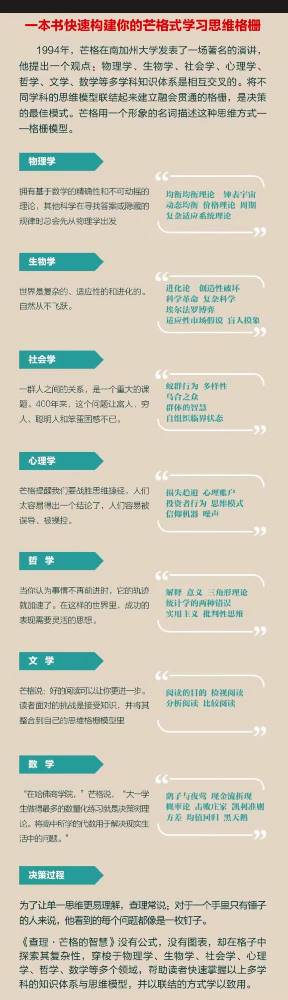

* content
{:toc}

## 引言

在《穷查理宝典》读完后开始读这本书，《查理·芒格的智慧》的目录为：思维格栅模型、物理学、生物学、社会学、心理学、哲学、文学、数学、决策过程。读了前面3章，每一章都从浅入深过渡到投资相关内容，有些观点挺有启发性的。为了更好的阅读后面章节，提前查了一下该书本的相关内容。下面做一些记录。后面还会补充读后的笔记。

## 目录

前言

第1章　思维格栅模型

第2章　物理学

第3章　生物学

第4章　社会学

第5章　心理学

第6章　哲学

第7章　文学

第8章　数学

第9章　决策过程

附录：圣约翰学院推荐阅读书目

注释

参考文献

致谢

译后记

## 笔记一

这本书译自英文，2000年最初出版的时候书名是：Latticework：The New Investing，2001年出平装版的时候，改名为：Investing：The Last Liberal Art（投资：自由艺术的绝响）。当时也有中译本，不过书名变成了《从牛顿、达尔文到巴菲特：投资的格栅理论》（机械工业出版社，2002年）。2013年英文版出版了第二版，增添有了一些内容，但是英文书名依然是关于投资艺术。

原本几个版本的书名里并没有提查理·芒格，反而是有提到过巴菲特。可能是近年来查理·芒格——这个经常藏于伯克希尔·哈撒韦公司幕后的投资家——渐渐为人们所知，所以出版方也要蹭蹭他的热度。

作者说，有一次，他听了查理·芒格关于“普世智慧”的演讲，查理在演讲中提出，我们面临的大量问题，需要将它们放进横跨多个学科的格栅中才能解决。作者说，现代教育的一个问题就在于，将知识进行分类，所以虽然我们获得了很多知识、信息，却缺少智慧。所谓智慧，可以理解成将不同的知识联系起来的能力。

作者将芒格倡导的多元思维模型比做格栅理论。所谓格栅，笔者其实之前并不知道是啥。后来查了一下，这个词的英文是latticework，就是格子架。那么格栅理论的意思，就好比是把这些理论放进一个个格子里面，并将它们连接贯通起来，从而获得智慧。

反正那次作者听了查理的话，有醍醐灌顶的感觉，所以就决定写一本书，内容就是他认为做投资需要掌握的相关学科知识和概念，并将它们与投资和市场联系起来，更好地理解市场、进行投资。那么，从这个角度看，将查理·芒格的名字和加到书名里面，倒也说得过去。著名数学家、提出“碎形”理论的贝努瓦·曼德勃罗（Benoit Mandelbrot）说过，错误的解释源于错误的描述。也就是说，如果我们不能精确地描述一个现象，我们就一定不能准确地解释它。

市场是一个复杂的适应性系统，涉及社会和人的方方面面。经济学、会计学和金融学这些知识，不能完全描述市场行为，我们还需要了解更多的知识----社会学、心理学、物理学、化学，甚至哲学、文学等等，这些都可以帮助我们增加投资的智慧。

这就是这本书主题和内容背后的逻辑，也是搭起全书结构的一条主线。

那么“查理·芒格的智慧”这本书，到底说了啥呢？如果用一句话概括，就是：这本书回顾了物理学、生物学、社会学、心理学、哲学、文学、数学中主要的思维模式，并检讨了这些概念与投资、市场是如何关联的。

比如从物理学里面，我们知道有一个很重要的概念是均衡的理论——力是平衡的，能量是守恒的，等等。那么作者从中就引出一个有效市场的理论。他指出，市场中有非常多的聪明人，他们会获得与股票有关的所有信息，并且会迅速地将这些信息反应到股票的价格中去，在任何人获利之前，让市场回复到均衡状态。换句话说，股价已经完全反映了可获得的信息。

再比如，将生物学与投资相联系，可以看到，跟生物系统一样，经济系统本质上是不断进化的。约瑟夫·熊彼特（Joseph Alois Schumpeter）认为，资本主义是不断创新和创造性破坏的过程。他认为，创新、企业家和信用是动态的经济过程的3个要素。

作者还谈到了社会学。社会学是以群体行为作为研究对象。关于群体行为，作者提到了集体决策的优势。他以统计学教授诺曼·约翰（Norman L. Johnson）进行的迷宫实验为例。诺曼

在电脑上设计了一个有无数路径的迷宫，其中有一些穿过迷宫的路径比较短。他发现，当人数超过5人时，他们一起解决问题的能力，就要超过个体叠加之和。当人数超过20人时，即使他们之前从来没有接触过这个迷宫，他们也能很快找到最短的那些路径。

英国学者弗朗西斯·高尔顿（Francis Galton）在1907年做过一个猜牛实验，也得到了相似的结果。在这个实验里，弗朗西斯发现，大家猜测的牛的重量的中值，非常接近那头牛的真实重量。

《群体的智慧：如何做出最聪明的决策》（中信出版社，2010年）一书的作者詹姆斯·索罗维基（James Surowiecki）认为，集体能够产生优秀的决策取决于两项因素：多样性和独立性。如果一个集体能够容纳多种多样的、从各方面思考问题的个体，其决策会优于一群思想相似人。这一论断，在我们这样一个社会，难道不是很有启示意义吗？

如果说社会学更关注群体，那么心理学则主要关注个体。在心理学一章，作者提到了预期理论中，人们对于损失的厌恶。诺贝尔经济学奖得主丹尼尔·卡尼曼（Daniel Kahneman）在《思考，快与慢》中指出，个体对于损失的内疚，差不多是获得等量财富的愉悦的2～2.5倍。这就可以解释为什么投资上"止损"对很多人是那么难了。

心理学当中与投资相关的理论和发现还包括：
* 信息过载会导致知识幻觉。人们对于预期或判断获得的信息越多，对预期正确性的自信心的增速，就比准确性要快得多。
* 如果人们认为投资的回报取决于个人的能力时，会倾向于承担更高的风险；如果认为取决于机会，则会做出更保守的选择。

作者还谈到了哲学，尤其是实用主义哲学，对于投资的意义。作者提示我们，没有一个理论是对现实的绝对性描述，但是每一个理论在某些方面都有些许作用。实用主义"让我们在未知的世界里航行，而不至于在绝对真理的荒岛上搁浅"。

作者还提出要阅读文学类书籍。为什么呢？因为我们要从经历当中学习，这不仅限于自己的经历，还包括作家在文学作品中想象和虚构的经历。作者说，我们能够比别人做得好、甚至进一步打败市场，就要有跟别人不一样的数据分析方法，"还有对不同信息的需求以及经历的不同"。

最后，作者讲到了数学。这一章主要介绍了统计学的一些概念和知识，比如正态分布、均值回归、贝叶斯原理以及与它们相关的黑天鹅事件和肥尾理论等。

本书最后一章是关于决策过程。作者再次提到了卡尼曼的认知理论，指出做出投资决策，不是靠直觉，而是依靠理性思考。我们最常犯的思维错误"和智商没有太大关系，而是和理性相关——或者更准确地说，是因为缺乏理性"。

作者总结说，我们学习投资的艺术和科学，就是应该与不同学科的"规则、策略、流程和知识"相结合。换句话说，建立好的思维模型，就要对各种学科有广泛的了解，还要具备通过隐喻和象征进行思考的能力。

## 笔记二

如何将书中的跨学科思维模型融入到日常的投资决策中：

通过以下几个步骤实现：

1. 建立知识框架：首先，需要构建一个跨学科的知识框架，这包括对物理学、生物学、社会学、心理学、哲学、文学、数学等领域的基本理论和原理有所了解。这些知识将作为分析和决策的基础。

2. 识别关键原理：从每个学科中识别出与投资相关的关键原理。例如，从物理学中学习均衡和动力学原理，从生物学中学习适应性和进化原理，从社会学中学习群体行为和市场趋势，从心理学中理解认知偏差和行为金融学，从哲学中探索逻辑和批判性思维，从文学中学习隐喻和叙述对投资决策的影响，从数学中掌握概率和统计工具。

3. 多角度分析：在面对投资决策时，尝试从不同学科的角度进行分析。例如，评估一个公司的投资价值时，不仅考虑其财务数据（经济学视角），还要考虑其在市场中的定位和适应变化的能力（生物学视角），以及管理层的决策过程和企业文化（心理学和社会学视角）。

4. 综合决策：将不同学科的分析结果综合起来，形成一个全面的投资决策。这要求投资者能够识别和整合各种信息，避免单一视角带来的偏见。

5. 持续学习和适应：市场和经济环境不断变化，投资者需要持续学习新知识，更新自己的思维模型，并根据新的信息和经验调整投资策略。

6. 反思和修正：定期反思投资决策的结果，分析成功和失败的原因。通过反思，可以识别思维模型中的缺陷，并进行修正和改进。

7. 实践和应用：将跨学科的思维模型应用于实际的投资决策中，通过实践来检验模型的有效性，并根据实践结果进行调整。

8. 风险管理：利用跨学科的知识来更好地理解和管理风险。例如，从数学和统计学中学习如何量化风险，从心理学中了解如何控制情绪对风险管理的影响。

9. 沟通和交流：与其他投资者和专家交流，分享跨学科思维模型的应用经验，获取反馈，不断完善自己的投资决策过程。

通过这些步骤，投资者可以将书中的跨学科思维模型融入到日常的投资决策中，提高决策的全面性和深度，从而在复杂多变的市场中做出更明智的投资选择。

（参阅 <https://book.douban.com/review/16182409/>）

## 读书小结

